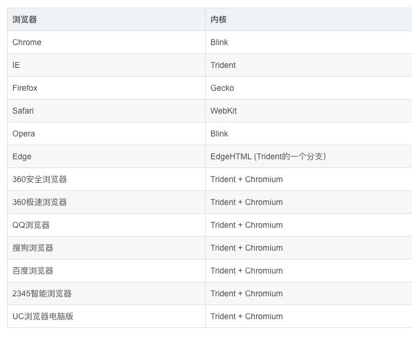
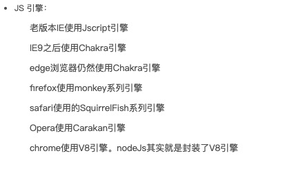

## 0.1. 前言

### 0.1.1. ES5，ES6和JavaScript的关系
众所周知，JavaScript是一位网景公司的奇人布兰登艾奇花了十天就开发出来的。一开始JavaScript叫LiveScript，当时Java特别火，为了蹭个热度，网景公司将其改名成了JavaScript。

微软在IE3的时候加入了JavaScript的实现，为了避免纠纷，命名为JScript。还有其他公司自己研发了JavaScript，所以这样兼容性就称为一个很头疼的事情，所以业内人士强烈呼吁定制一个标准。

1996年，网景公司将JavaScript提交给国际标准化组织ECMA，次年，该组织发布了浏览器脚本语言的标准，并将这种语言称为ECMAScript，也就是我们常说的ES。所以ES是一种标准，JavaScript是ES的实现。

ES5是指ECMAScript5.0，ECMAScript5.1版本，ES6是泛指，指5.1版本以后的JavaScript的下一代标准。

<!--more-->
## 0.2. 编译性语言 vs 解释性语言

高级语言要经过翻译，称为机器语言，然后才能被计算机识别。

翻译分为编译和解释。

编译性语言在程序运行前有一个专门的编译过程，把程序编译成计算机可执行的文件，比如.exe,以后要运行的话就不用在编译了，直接执行就可以了。Java就是比较典型的编译性语言。Java有一句很有名的口号：一次编译，到处运行。

解释性语言也是要转换成计算机能识别的语言，只是它是在代码运行时执行，所以需要将解释器安装在环境中。

JavaScript，python是解释性语言。

需要注意的一点是解释性语言不是说没有编译，它们有的会有编译特性，即时编译的。

## 0.3. 浏览器内核
浏览器内核指的是浏览器运行的最核心的程序，分为两个部分，JS引擎和渲染引擎。

 

JavaScript引擎的主要作用是，读取网页中的JavaScript代码，对其处理后运行。

## 0.4. 引子
 
 	console.log(0)
 	setTimeout(function(){
 		console.log(1)
 	},0)
 	console.log(2)
 	
输出结果是什么？

## 0.5. 单线程

单线程说明在同一个时间里只能做一件事情，有人会说js为什么是单线程，不能多线程，多线程效率不更高吗。原因是js主要用来做页面交互，操作DOM。如果是多线程的话，有可能会发生两个线程同时对一个DOM进行操作，比如一个是添加了一个节点，一个是删除节点，那么浏览器怎么去执行？所以为了避免复杂性，js就是单线程的。

## 0.6. 事件循环机制

事件循环机制分为浏览器和node事件循环机制，在此主要介绍浏览器事件循环机制。

在js中任务分为两种，同步任务和异步任务。

所谓同步就是函数或方法执行时要接收到返回的值或者消息才会往下执行，相当于打电话，你说一句，我说一句，一句接一句。

异步则是函数或方法执行时，不需要等待收到返回的信息和值，直接向系统委托一个异步过程，系统接收到返回结果时，系统会触发委托的异步过程，从而完成一个完整的流程。

一般异步任务有：

1. setTimeout和setlnterval
2. DOM事件
3. ES6中的Promise
4. Ajax异步请求

事件循环机制的流程是这样的：

1. 主流程上有一个执行栈，同步任务依次进栈排队，任务从栈的顶部开始执行，执行完的任务会被弹出去。
2. 异步任务有了结果的时候，会在任务队列里放入‘回调’事件。
3. 执行栈里所有的同步任务运行完后，会去任务队列里查看，是否还有任务，如果有的话就会将任务读进执行栈中，开始执行。
4. 主线程不断重复以上3个行为。

因为这个过程是循环不断的，所以称为事件循环机制。

### 0.6.1. 练习题 写出以下输出结果

练习题1

	console.log('a')
	while(true){}
	console.log('b')
	
练习题2
	
	console.log('1')
	setTimeout(function(){
		console.log('2')
	},0)
	while(true){}
	
练习题3

	for(var i = 0; i < 5; i++) {
		setTimeout(function(){
			console.log(i)
		},1000)
	} 
	
练习题4

	for(var i = 0; i < 5; i++) {
		setTimeout(function(){
			console.log(i)
		},1000 * i)
	} 
	
作业

怎么依次隔秒输出0，1，2，3，4

## 0.7. css常见布局

### 0.7.1. 上定高，中间分左右，左定宽，右自适应

### 0.7.2. div垂直水平居中

1. 行内元素居中 缺点： 会继承，影响到后代行内内容，子元素大于父元素宽度时无效

	text-align: center

2. 单个块级元素 必须定宽，且元素宽度要小于父元素宽度

	width: 100px // 定宽
	margin: 0 auto

3. 多个块级元素

	`#parant` { text-aligin: center}
	
	`#son` {display: inline-block}
	
4. 使用绝对定位 （子元素定宽定高）

	`#parant` { 
		position: relative
		width: 100px
	}
	
	`#son` {
		position: absolute
		left: 50%
		width： 100px
		height：100px
		margin-left: -50px // 或者translateX(-50%)
		margin-top：-50px; // translateY(-50%)
	}
	