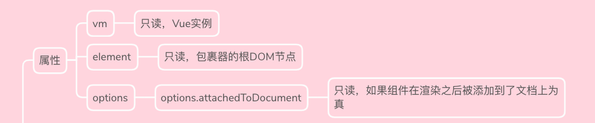
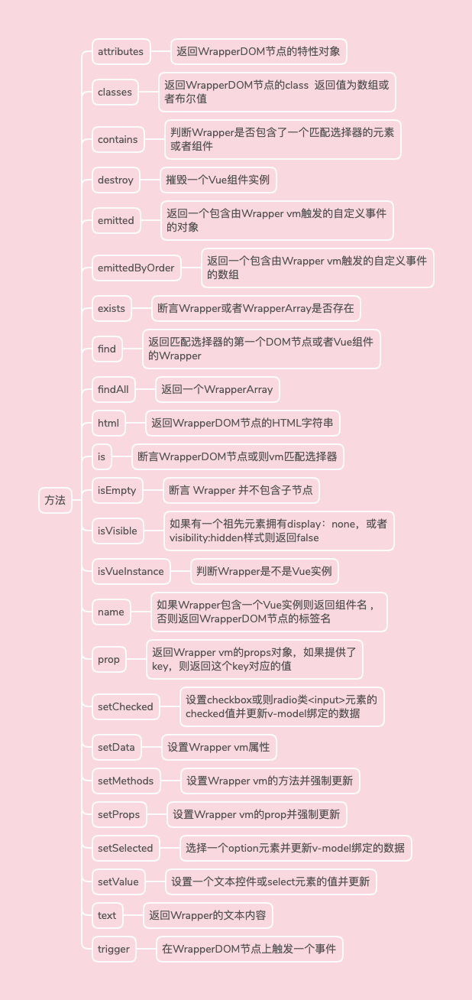
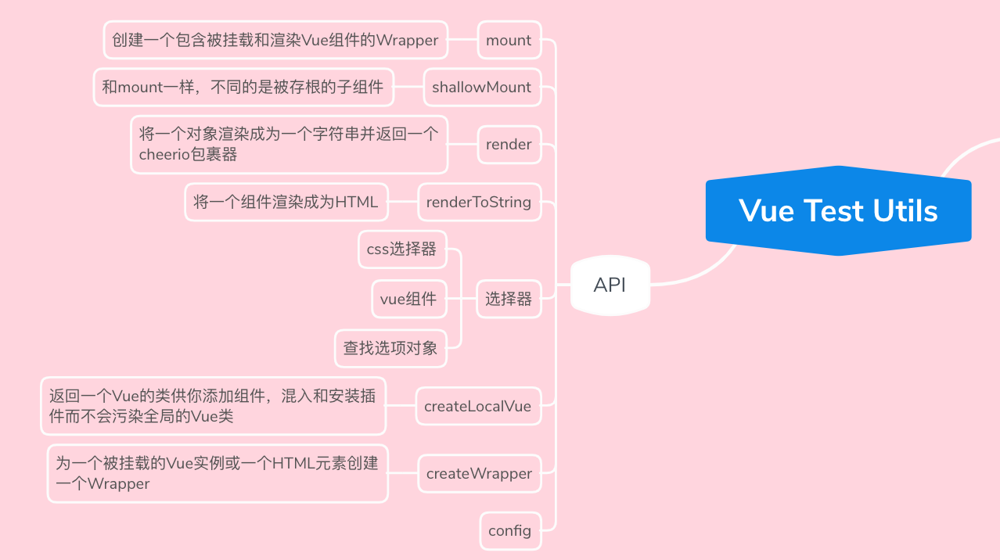

# 前言

上一篇主要分享了怎么在vue+ts项目中搭建Jest环境，这一篇主要是分享Jest联合vue官方出的单元测试库vue-test-utils一起在项目的使用

# Jest

##  匹配器

基本的测试我们通过expect(value)去实现，比如我们有一个函数sum, 它的返回值是20，然后我们要校验它的返回值是不是20，就可以这么写测试

```
test('test function sum', () = > {
    expect(sum()).toBe(20)
})
```

toBe函数就是一个匹配，校验expect的参数的结果是不是和toBe的参数一致，如果一致，验证通过，否则验证不通过。

除了toBe，还有很多匹配器，可以去官网看下 [API](https://jestjs.io/docs/zh-Hans/using-matchers)


toBe是使用`Object.is()`,如果需要测试精确的相等，需要用toEqual

```
test('object assignment', () => {
  const data = {one: 1};
  data['two'] = 2;
  expect(data).toEqual({one: 1, two: 2});
});
```

下面图中显示了我们常用的一些匹配器


所有匹配器都可以用`.not`取反

## 异步测试

### 回调函数

### Promise

### async/await


## 钩子函数


### beforeEach


### beforeAll


### afterEach


### afterAll


## 分组--describe

作用域

## Mock

# Vue Test Utils 

Vue Test Utils  是vue官方的test工具

## 引入Vue Test Utils


```test.spec.ts
import { mount, shallowMount, createLocalVue } from '@vue/test-utils'
```

可以在测试文件的顶部通过上面的代码引入Vue Test Utils 

## Wrapper

Vue Test Utils 是一个基于包裹器的 API。

一个 Wrapper 是一个包裹器，它包括了一个挂载组件或 vnode，以及测试该组件或 vnode 的方法。

### Wrapper 属性



### Wrapper 方法



## api




# 实战

```dept.vue

```

1. 测试查询的表单的输入框的初始值是不是都是空
2. 测试添加按钮是不是正常
3. 测试table请求是不是返回正常（或者下拉框的请求是不是正常）
4. 测试操作列是不是正常
5. 测试事件点击时候的操作正常不正常
6. dialog的表单的初始值是不是正常
7. dialog的按钮点击事件是不是正常
8. ？ 下拉框的事件


