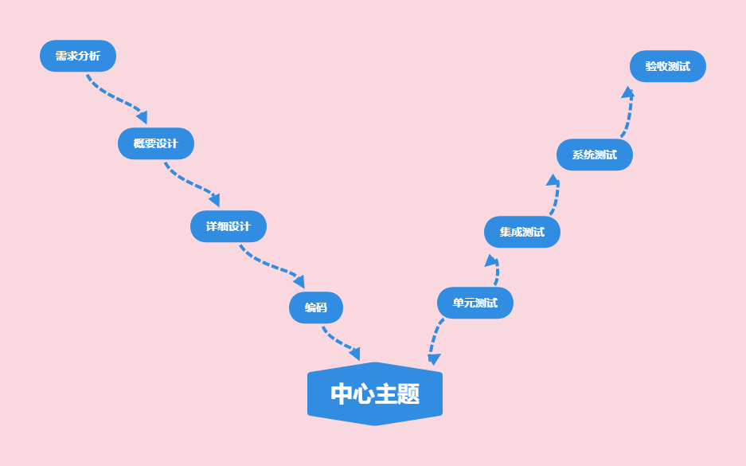
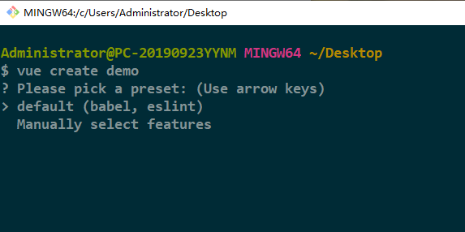
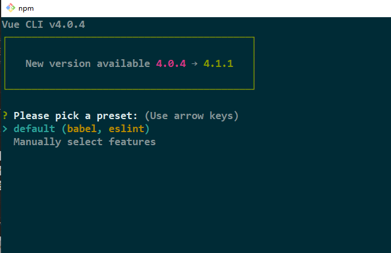
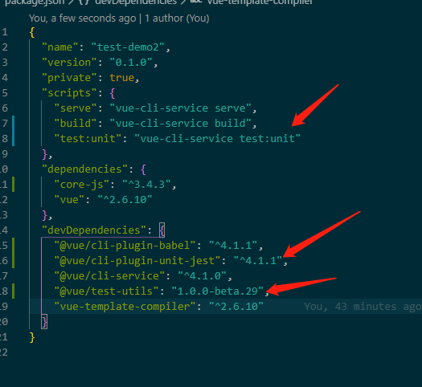
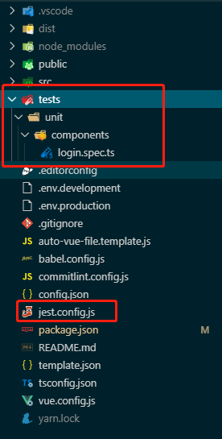
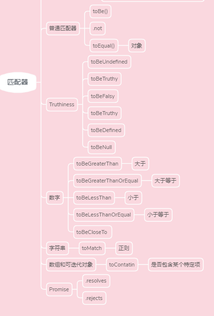

# 什么是单元测试

先上个图


这个图我们很熟悉，这个在大学某软件课程里会看到这个，这是一个简易的软件的生命周期。

可以看到我们单元测试对应的是编码。单元测试是对我们软件中的最小可测试单元进行检查和验证，比如一个函数，一个模块。单元测试一般来说是开发人员去执行，剩下的集成测试，系统测试等由专业的测试人员来进行。

单元测试不需要访问数据库

单元测试不需要访问网络

单元测试不需要访问文件系统

<!--more-->
# 为什么要使用单元测试

1. 可以验证代码的正确性，在上线前心里有底
2. 一次编写，多次运行，就不需要我们在代码里console打印
3. 便于重构，有测试用例在，我们方便知道重构后的代码是否正确


# 怎么使用单元测试 --Jest


## Jest是什么

> Jest是一个JavaScript测试框架，旨在确保任意JavaScript代码的正确性。 它允许你用可访问的、熟悉的和功能丰富的 API 来写测试，让你快速获得结果。
> Jest文档齐全，仅需很少的配置，可以扩展到符合你的要求。
>Jest使测试变得愉快。                ---Jest 核心团队


## 引入jest

引入方式分为两种，一种是创建项目时引入，一种是创建时没有引入，后期引入。

### 初始化时引入

用git bash执行`vue create demo`时发现交互提示符不工作，



搜了一下，发现要通过`winpty vue.cmd create demo`去运行，
然后不想每次都写那么长的命令的话，可以在Git/etc下的bash.bashrc文件的最后一行加入如下代码

```
alias vue='winpty vue.cmd'
```

这样就能可以用`vue create`



单元测试中选中Jest即可

### 后期引入

昨天下午大佬说你现在好像没有什么事情了，我把Jest加入到了项目，你自己看看，看懂了做个分享。

所以没有接触过单元测试的我开始了 ~~走向掉更多头发~~ 走向光明的道路。

我们主要是介绍后期引入这种方法，~~愚蠢~~机智的我通过上面的方法创建了一个新项目，然后去package.json，看用到了哪些包，然后下载下来,主要用到下面这几个


#### jest && ts-jest && @types/jest

首先我们在项目的根目录在终端打开，输入

```
npm install -D jest ts-jest @types/jest
```

#### @vue/cli-plugin-babel


```
vue add @vue/cli-plugin-babel
```

#### @vue/cli-plugin-unit-jest


```
vue add @vue/cli-plugin-unit-jest
```

运行后会发现，package.json会多了如下三行



Vue Test Utils 是 Vue.js 官方的单元测试实用工具库。

可以看到我们scripts多了一个命令`test:unit`,我们可以改写成"test": "jest"，不改也没有什么问题

我们安装这个@vue/cli-plugin-unit-jest依赖的时候，会在根目录下生成一个test文件夹，和一个jest配置文件jest.config.js




Jest识别三种测试文件，以.test.j/ts结尾的文件，以.spec.j/ts结尾的文件，和放到__tests__ 文件夹中的文件

### 遇到的问题

#### BUG1: 测试文件里引入.vue文件,识别不了


原因： 不知道为什么src/shims-vue.d.ts没有起作用，将这个文件移动到项目根目录就可以
 

## 怎么用Jest

###  验证-匹配器

基本的测试我们通过expect(value)去实现，比如我们有一个函数sum, 它的返回值是20，然后我们要校验它的返回值是不是20，就可以这么写测试

```
test('test function sum', () = > {
    expect(sum()).toBe(20)
})
```

toBe函数就是一个匹配，校验expect的参数的结果是不是和toBe的参数一致，如果一致，验证通过，否则验证不通过。

除了toBe，还有很多匹配器，可以去官网看下 [API](https://jestjs.io/docs/zh-Hans/using-matchers)


toBe是使用`Object.is()`,如果需要测试精确的相等，需要用toEqual

```
test('object assignment', () => {
  const data = {one: 1};
  data['two'] = 2;
  expect(data).toEqual({one: 1, two: 2});
});
```

下面图中显示了我们常用的一些匹配器




