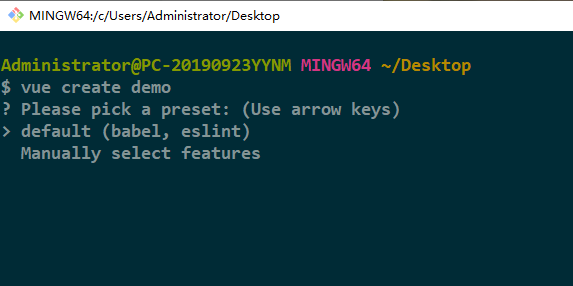
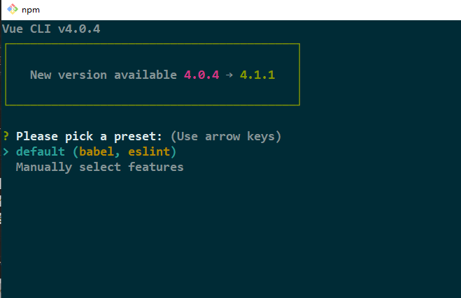
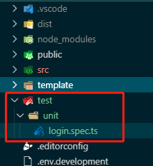

# 前言

# 引入Jest

引入方式分为两种，一种是创建项目时引入，一种是创建时没有引入，后期引入。

## 创建时引入

用git bash执行`vue create demo`时发现交互提示符不工作，



搜了一下，发现要通过`winpty vue.cmd create demo`去运行，
然后不想每次都写那么长的命令的话，可以在Git/etc下的bash.bashrc文件的最后一行加入如下代码

```
alias vue='winpty vue.cmd'
```

这样就能可以用`vue create`



单元测试中选中Jest即可

## 后期引入

昨天下午大佬说你现在好像没有什么事情了，我把Jest加入到了项目，你自己看看，看懂了做个分享。

所以没有接触过单元测试的我开始了 ~~走向掉更多头发~~ 走向光明的道路。

我们主要是介绍后期引入这种方法，~~愚蠢~~机智的我通过上面的方法创建了一个新项目，然后去package.json，看用到了哪些包，然后下载下来,主要用到下面这几个

```
npm install -D jest ts-jest @types/jest @vue/cli-plugin-unit-jest @vue/cli-plugin-babel
```

然后我们需要在项目根目录下创建一个jest.config.js文件，内容如下

```
module.exports = {
  preset: '@vue/cli-plugin-unit-jest/presets/typescript-and-babel'
}
```

然后我们需要在package.json中的script模块中加入

```
"test:unit": "vue-cli-service test:unit"
```

然后我们在项目根目录下创建test目录，然后该目录下有unit目录，我们的测试文件就放在unit目录下,测试文件的命名可以为模块名.spec.ts或者是模块名.test.ts，我们项目用了ts，所以后缀是ts，没有用的话就js,如果是测试函数的话，就可以是function.函数名，后面是一样的。




# 如何使用Jest