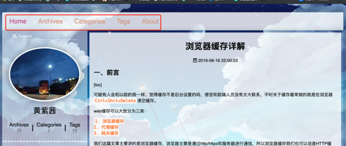
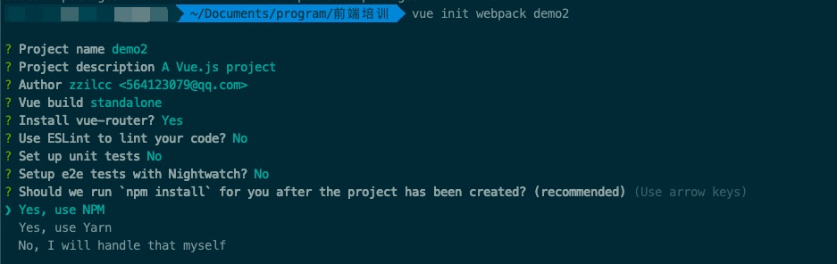
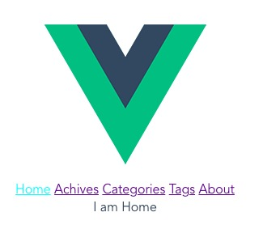
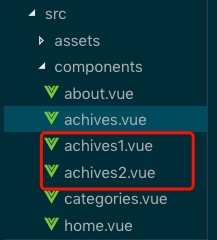

## 前言


### 单页应用 vs 多页应用



以我的博客为例，很多网站会有这样的布局，头部会有一个导航栏，每次点击页面会切换。

如果是多页应用MPA（Mutiple Page Application）的话，就是每一个导航是一个html，比如我的博客，导航里有5项，那么就有5个html，每次点击，都进行了html切换，每次都要加载新的html。

如果是单页应用，就只有一个html，没有导航切换的时候只是切换html页面内容，不会切换html。

<!--more-->

#### 多页应用

多页应用的优点是首次页面加载时间快，SEO效果好，缺点是页面切换慢。

因为多页应用是把系统分成很多个html，所以每次加载只加载了一个html，所以首次页面加载快。

SEO指搜索引擎优化，它是一种通过分析搜索引擎的排名规律，了解各种搜索引擎怎样进行搜索、怎样抓取互联网页面、怎样确定特定关键词的搜索结果排名的技术。

多页应用的内容基本都是直接写在html页面，这样搜索引擎就比较好好识别，所以seo排名效果好。

页面切换慢的原因是因为没有切换页面，都要重新请求html，相当于重新渲染页面，渲染整颗DOM树。

#### 单页应用

>单页Web应用（single page web application，SPA）无疑是目前网站开发技术的弄潮儿，很多传统网站都在或者已经转型为单页Web应用       ---《单页Web应用：JavaScript从前端到后端》

单页应用相对于多页应用，比较明显的优点就是切换页面时间比较快，因为单页应用切换不需要重新请求html，它只是重新渲染dom树的其中一部分。但是因为单页应用把所有的内容都放到一个html里，所以他的首次加载页面时间会相对来说比较慢，要加载的内容比较多，而且一般单页应用的内容主要通过js去切换渲染，所以内容都是动态生成，不是直接写在html里，所以seo效果比较差。

搭建一个项目的时候到底是用多页面还是单页，这需要根据具体情况去分析。


## Vue Router是什么？

官方解释什么是Vue Router

Vue Router 是 Vue.js 官方的路由管理器。它和 Vue.js 的核心深度集成，让构建单页面应用变得易如反掌。包含的功能有：

1. 嵌套的路由/视图表
2. 模块化的、基于组件的路由配置
3. 路由参数、查询、通配符
4. 基于 Vue.js 过渡系统的视图过渡效果
5. 细粒度的导航控制
6. 带有自动激活的 CSS class 的链接
7. HTML5 历史模式或 hash 模式，在 IE9 中自动降级
8. 自定义的滚动条行为

## 为什么要用Vue Router？

在单页应用中所有的东西都在一个html页面中，我们进行页面切换需要用到路由。

## 怎么用Vue Router？

### 一个简单的单页面应用

下面介绍的是vue-cli2.0下怎么用Vue Router

 首先我们先安装一下vue-cli2.0
 
 
 
 可以看到，我们安装vue-cli 模版的时候可以选择安不安装Vue-Router，在这边我们选择yes。
 
 项目创建完成后我们看下`src\main.js`
 
 ```js
 // The Vue build version to load with the `import` command
// (runtime-only or standalone) has been set in webpack.base.conf with an alias.
import Vue from 'vue'
import App from './App'
import router from './router' // 引入了路由

Vue.config.productionTip = false

/* eslint-disable no-new */
new Vue({
  el: '#app',
  router, // 使用路由
  components: { App },
  template: '<App/>'
})

 ```
 
首先我们把`src\App.vue`这个文件加上一个导航nav
 
```vue
 <template>
  <div id="app">
    
    <nav>
      <router-link class="fd-header-item" to="/">Home</router-link>
      <router-link class="fd-header-item" to="/achives">Achives</router-link>
      <router-link class="fd-header-item" to="/categories">Categories</router-link>
      <router-link class="fd-header-item" to="/tags">Tags</router-link>
      <router-link class="fd-header-item" to="/about">About</router-link>
    </nav>
    <router-view/>
  </div>
</template>

<script>
export default {
  name: 'App'
}
</script>

<style>
#app {
  font-family: 'Avenir', Helvetica, Arial, sans-serif;
  -webkit-font-smoothing: antialiased;
  -moz-osx-font-smoothing: grayscale;
  text-align: center;
  color: #2c3e50;
  margin-top: 60px;
}
.fd-header-item {
  cursor: pointer;
}
.fd-header-item:hover, .router-link-exact-active{
  color: aqua;
}
</style>

```

我们可以看到两个比较特殊的标签`<router-link></router-link>`，`<router-view/>`

`<router-link>`主要是用来做页面跳转的，一般写导航，`<router-link>`里的组件会渲染到`<router-view/>`

我们一个导航项创建一个组件，所以我们在`src\components\`下创建五个组件，分别是home.vue, achives.vue, categories.vue, tags.vue, about.vue

Vue Router 给我们设置了高亮的样式`router-link-exact-active`，所以我们可以设置一个选中颜色。

```
.fd-header-item:hover, .router-link-exact-active{
  color: aqua;
}
```

router-link里的to参数代表着你要跳转的路径，我们可以看下`src\Router\index.js`

在这个js中我们引入了这五个组件，然后写了它们相应的路由

```js
import Vue from 'vue'
import Router from 'vue-router'
import home from '@/components/home'
import achives from '@/components/achives'
import categories from '@/components/categories'
import tags from '@/components/tags'
import about from '@/components/about'

Vue.use(Router)

export default new Router({
  routes: [
    {
      path: '/',
      name: 'home',
      component: home
    },
    {
      path: '/achives',
      name: 'achives',
      component: achives
    },
    {
      path: '/categories',
      name: 'categories',
      component: categories
    },
    {
      path: '/tags',
      name: 'tags',
      component: tags
    },
    {
      path: '/about',
      name: 'about',
      component: about
    }
  ]
})

```

我们看下这个home.vue,在点击home时我们显示I am Home ，其他几个页面相应的会输出。

```vue
<template>
  <div class="hello">
    {{msg}}
  </div>
</template>

<script>
export default {
  name: 'home',
  data () {
    return {
      msg: 'I am Home'
    }
  }
}
</script>

<!-- Add "scoped" attribute to limit CSS to this component only -->
<style scoped>
</style>
```



到此一个简单单页面应用的基本框架就算搭好了。在此之中我们接触到了三个很类似的单词：route，routes，router。

route他是一条路由，比如home这个a标签链接指向home页面的内容。

routes是一组路由，也就是由route组成的一组数组

router是一个机制，路由机制。

### 多级导航（嵌套路由）

#### 需求描述

现在在Achives导航下有两个二级导航achives1和achives2，点击Achives1和Achives2分别跳转到相应的页面。

#### 实现思路

1. 在src/component下创建两个子页面achives1.vu和achives2.vue
2. 在src/router/index.js里配置子路由
3. 在archives.vue写上`<router-view/>`
4. 在App.vue里写Achives点击事件，点击后出现二级导航

#### 实现过程

创建了两个子页面



achives1.vue页面如下

```vue
<template>
  <div class="hello">
    {{msg}}
  </div>
</template>

<script>
export default {
  name: 'achives1',
  data () {
    return {
      msg: 'I am Achives1'
    }
  },
  mounted () {
  }
}
</script>

<!-- Add "scoped" attribute to limit CSS to this component only -->
<style scoped>
</style>

```

src/router/index.js

```js
{
  path: '/achives',
  component: achives,
  children: [
    {
      path: 'achives1',
      component: achives1
    },
    {
      path: 'achives2',
      component: achives2
    }
  ]
}
```

可以看到我们在achives的路由中加了一个children属性,这个属性是一个数组，然后有两项，也就是我们的两个子页面的路由，相应的path是路径，component是组件，所以我们要在src/router/index.js里引入这两个组件

```js
import achives1 from '@/components/achives1'
import achives2 from '@/components/achives2'
```

在父页面achives.vue

```vue
<template>
  <div class="hello">
    {{msg}}
   <router-view/> // 新增的
  </div>
</template>

<script>
export default {
  name: 'achives',
  data () {
    return {
      msg: 'I am Achives'
    }
  }
}
</script>

<!-- Add "scoped" attribute to limit CSS to this component only -->
<style scoped>
</style>

```

最后我们只要在App.vue添加相应的点击事件和router-link

## 参考

1. 《单页Web应用：JavaScript从前端到后端》