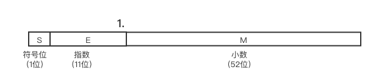

## 前言

最近才发现自己一直混淆了Number.Max_Value和Number.MAX_SAFE_INTEGER，然后经过一段的研究和学习，终于搞懂了。耐心看完这一篇你会了解到IEEE 754标准的浮点数的表示，了解到JS Number对象的最大（小）值，最大（小）安全值都是怎么来的；NAN，正负无穷大，正0，负0在计算机中都是怎么存储的；还有为什么0.1+0.2==0.3 为什么是false

## 为什么是1-2^53至2^53-1

### 双精度浮点数 （IEEE 754）

JavaScript的Number类型为双精度IEEE 754 64位浮点类型。我们来看下图

IEEE 754 双精度的格式：`(-1)^s*1.M*2^(E-127)`

#### 符号位

1 代表负，0代表正

#### 指数位

指数位是IEEE 754的阶码，是用移码表示，移码和补码只有符号位是相反的，所以补码的符号位1代表正数，0代表负数 

## 结束语
