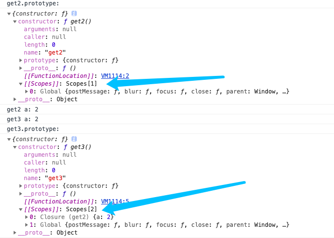
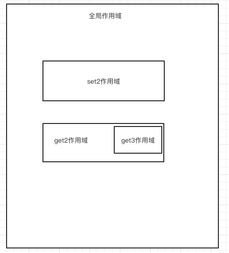
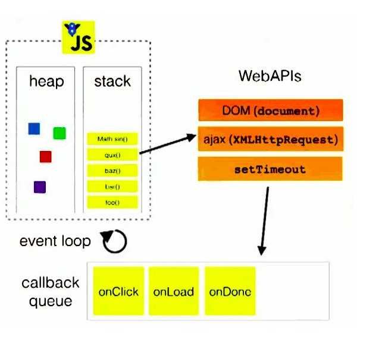
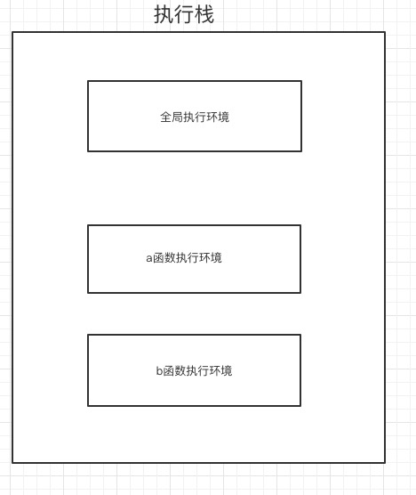
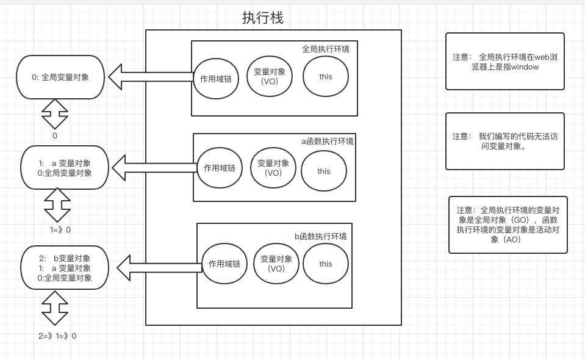

## 一、js引擎执行过程

    var a;
    console.log(a);
    console.log(b);

输出？

    a = 2;
    var a;
    console.log(a);

输出？

    console.log(a);
    var a = 2;

输出？

我们之前说过js代码是由上到下去执行的，但是上面代码的输出结果好像显示的不是这样，其实不是的，js代码确实是由上到下去执行的，只是执行的不是我们直接写的代码，而是我们代码通过编译后生成的代码。

我们可以将js引擎执行过程分为三个阶段，分别是语法分析，预编译和解释执行阶段。
<!--more-->

## （1）语法分析
语法分析主要是对代码进行语法检查，如果语法有错，会抛出错误，如果没有错，则进入预编译阶段，
## （2）预编译

我们可以将预编译分成四个步骤

1. 创建GO（全局）/ AO（活动）对象
2. 找形参和变量声明，将变量和形参名作为GO/AO属性名，值为undefined
3. 将实参和形参统一
4. 在函数体里找函数声明，值赋予函数体

### 函数声明和函数表达式的区别
主要看第一个词是不是function,第一个词是function为函数声明，其他的都是函数表达式

    function () {} // 函数声明
    var a = function () {} // 函数表达式

示例： （代码已经过语法检查，没有语法错误）

    function a () {
        var b =10;
        function c () {
            var b =123;
            console.log(b);
            function d (){}
        }
        console.log(b);
        console.log(c);
    }
    var b =123;
    a();

1. 一进来默认的是全局对象GO，在此是window对象

2. 找变量声明b，将其作为window的属性，值为undefined 

3. 找函数声明，发现a函数, 将其作为window属性，值为a函数的函数体

此时Go对象为： 

    GO = {
        b: undefined,
        a: function () {
            var b =10;
            function c () {
                var b =123;
                console.log(b);
                function d (){}
            }
            console.log(b);
            console.log(c);
        }
    }

所以此时代码可以理解成 

    var b;
    var a = function(){
        // a的函数体
    };
    b = 123;
    a();

## （3）解释执行

此时引擎开始执行代码

把123赋值给b，运行a，运行a之前也会进行预编译。

    function a () {
        var b =10;
        function c () {
            var b =123;
            console.log(b);
            function d (){}
        }
        console.log(b);
        console.log(c);
    }

1. 新建一个AO对象
2. 查找变量声明，发现b,给AO对象添加一个属性b，值为undefined
3. 查找函数声明，发现c函数，给AO对象添加一个属性c，值为c函数体

AO对象

    AO = {
        b: undefined,
        c: function () {
            var b =123;
            console.log(b);
            function d (){}
        }
    }

此时代码可以理解成

    function a () {
        var b;
        function c () {
            var b =123;
            console.log(b);
            function d (){}
        }
        b = 10;
        console.log(b);
        console.log(c);
    }

然后开始执行a函数

## 变量和函数提升的一些注意事项

重名的声明后一个会覆盖前一个

    function foo () {
        console.log(a)
    }
    function foo () {
        console.log(b)
    }
    console.log(foo)

如果函数声明和变量声明重名了，函数声明会优先

    function foo () {}
    var foo;
    console.log(foo)

## 二、js作用域

### 作用域是什么？

作用域是根据名称查找变量一套规则。可以把作用域假设成一个管家。

### 作用域的类型

作用域可以分为全局作用域和局部作用域。

在执行``块或者js文件时，会生成一个全局作用域和一个window对象，在全局作用域里定义的变量和函数会变成window对象的属性。

局部作用域包括函数作用域和块级作用域

每次声明一个函数，就会生成一个函数作用域。

块级作用域： 

	1. with（不推荐）
	2. try/catch catch会创建一个块级作用域
	3. let

注意： 作用域可以嵌套，但是不能重叠。

	var a = 1;
	function get2 () {
		var a = 2;
		console.log('get2 a: '+ a);
		function get3 () {
			console.log('get3 a: ' + a);
		}
		get3();
		console.log('get3.prototype: ');
		console.log(get3.prototype);
	}
	function set2 () {}
	console.log('get2.prototype: ');
	console.log(get2.prototype);
	get2();

输出结果

可以看到我们在全局声明了一个函数叫get2，产生了一个函数作用域，这个作用域是被全局作用域包裹着，然后在get2函数里我们也声明了一个get3函数，也产生了一个函数作用域，这个作用域是被get2的作用域包裹着，所以是一层套一层。

###执行环境和作用域

执行环境是js中很重要的一个概念，他包括三部分： 变量对象（AO），作用域链，this。

执行环境有三个类型

	1. 全局执行环境 （js默认执行环境，在web浏览器的话是window对象）
	2. 函数执行环境 （每个函数自己的执行环境）
	3. eval执行环境

每个执行环境都有一个变量对象，环境中定义的函数和变量都保存在这个对象中。

	var c = 1;
	function a () {
		console.log(c)
		return function b () {
			console.log(c)
		}
	}
	a()
	let aa = a()
	aa()

当执行到一个函数a时，该函数a的执行环境会被推进一个执行栈，函数a里调用了其他函数b的话，会将调用的函数b的执行环境推进栈，然后执行完b函数的代码后，b执行环境被推出栈，然后继续执行a函数的代码，a执行完后，把a的执行环境推出栈，以此类推。

被推出栈的执行环境会被销毁，保存在其中的所有变量和函数定义也会被销毁，全局执行环境在页面关闭或者浏览器关闭时被销毁。

	function aa () {
		for(var a = 0; a < 5; a++){
			console.log(a)
		}
	}
	console.log(a)
	
	for(var b = 0; b < 5; b++){
		console.log(b)
	}
	console.log(b)
	

在函数外部是不能访问到函数内部定义的变量，所以第一个输出a会报错。然后b会输出5，因为js没有块级作用域，所以声明的b是被当作window的属性的，所以可以访问到。

当代码在一个环境执行的时候会创建变量对象的一个作用域链，全局执行环境的变量对象始终都是作用域链的最后一个。

很明显，a函数有自己的作用域，然后a函数又是在全局定义的，所以被包裹在全局作用域里，所以a的作用域链是自身作用域-全局作用域，在a中查找一个变量是，会在自身作用域查找（也就是找自身的变量对象里有没有这个属性），如果没有查找到就沿着作用域链上去找，找他的上一级作用域链，在这里是全局作用域。

我们之前说过作用域根据名称查找变量一套规则，可以把作用域理解成管家。

全局执行环境是一个酒店，函数执行环境是一个房间。

全局作用域是总管家，a函数作用域是a管家，依次类推。

我们以下面例子来说：

	var c = 1;
	function a () {
		console.log(c)
		return function b () {
			console.log(c)
		}
	}
	a()
	let aa = a()
	aa()

js引擎执行代码，从上到下执行，执行到a函数时发现`console.log(a)`，这时候引擎和作用域的对话如下：

b函数里`console.log(c)`里查找c以此类推，一层层找。如果在某个作用域里找到了，就不会继续找了，只会返回当前找到的值。

作用域链是单向的，只能从内到外，外面的执行环境是访问不到函数内部的变量。

## 三、闭包

	function foo () {
		var a = 2;
		function bar () {
			console.log(a)
		}
		return bar;
	}
	
	var f = foo();
	f();
	
我们来执行一下这段代码，

首先是语法检查，看有没有语法错误，没有，下一步

创建了全局对象GO，然后进行声明查找，先找变量声明，发现var a = foo();然后声明了一个a，作为GO的属性，值为undefined，然后查找函数声明，发现function foo，然后声明了一个函数foo作为GO的属性，值为foo的函数体。

然后开始解释执行代码，从上至下，首先将全局执行环境推进栈。

然后var f = foo() 执行foo函数。

将foo函数执行环境推进执行栈，然后进行第1-第2步，然后开始执行foo预编译后的代码，给a赋值为2，然后返回了一个函数bar。

将foo返回的bar赋值给f。这时候foo函数执行完，按照之前我们说的，函数执行完对应函数执行环境栈会被推出执行栈，但是这里没有，这就是闭包的神奇之处。

f()执行f函数，也就是foo里的bar函数。

在foo()执行之后，为什么内部作用域还在，没有被回收，是因为有‘人’在使用这个作用域，也就是f()，因为他保持着对foo作用域的引用，所以这个作用域没有被回收，这个引用就是闭包。

	var fn;
	function foo () {
		var a = 2;
		function baz () {
			console.log(a);
		}
		fn = baz;
	}
	function bb () {
		fn();
	}
	foo();
	bb();
	

也就是，将函数里的内部函数传递到他定义时所在定义域A之前，这个函数都会保留着对原始定义域A的引用，无论在何时调用这个内部函数都会使用闭包。

	function sleep (message) {
		setTimeout(function(){
			console.log(message)
		}, message)
	}
	sleep('hello');
	
这里也体现了闭包，我们可以先把代码再分解一下。

	function sleep (message) {
		function a () {
			console.log(message)
		}
		setTimeout(a, 1000)
	}
	sleep('hello');
	
我们在sleep函数里定义里一个函数a，然后将这个函数a当作参数传给了setTimeout函数，然后执行sleep函数，设置了一个定时器，此时sleep运行完了，理论上他的执行环境要被弹出执行栈，但是因为1秒后这个setTimeout函数时在全局执行环境里去执行的，也就是不是在sleep函数里执行，所以a函数当作参数执行时会保留着对sleep作用域的引用，所以此时输出message是‘hello’。

这就是闭包的神奇之处。

	for (var i = 0; i < 5; i++) {
		setTimeout(function(){
			console.log(i)
		}, i * 1000)
	}
	
上篇博客说这个程序是隔秒输出5，那么我们想要隔秒输出0，1，2，3，4呢？

这时候我们就可以利用函数作用域了，我们可以在for循环里定义一个函数，然后将每次循环的i传进函数里，函数里用一个变量存储，这样就能保存每次的i的值。

	for (var i = 0; i < 5; i++) {
		function aa(){
			var j = i;
			setTimeout(function(){
				console.log(j)
			}, j * 1000)
		}
		aa(i)
	}
	
然后我们再优化一下这个函数，

	for (var i = 0; i < 5; i++) {
		function aa(j){
			setTimeout(function(){
				console.log(j)
			}, j * 1000)
		}
		aa(i)
	}

在aa函数的形参里接收i的值。

然后我们再可以优化一下

	for (var i = 0; i < 5; i++) {
		(function(j){
			setTimeout(function(){
				console.log(j)
			}, j * 1000)
		})(i)
	}
	
在这里我们定义了一个匿名函数，然后立即执行了它。

上面的立即执行函数还有一种写法，把(i)放到（）里

	for (var i = 0; i < 5; i++) {
		(function(j){
			setTimeout(function(){
				console.log(j)
			}, j * 1000)
		}(i))
	}

一个函数怎么执行，一般是函数名+(),比如前面的aa(),然后我们要怎么让一个匿名函数执行呢，匿名函数没有函数名，其实只要把匿名函数的函数声明转换成一个函数表达式然后再加()就可以。

那么问题就变成了怎么把函数声明变成函数表达式

上面代码里用一对括号把函数括起来是其中一种方法，在函数前加上一元操作符`+`,`-`,`!`也可以将函数声明转换成表达式。
 
	-function	(j) {
		console.log(j)
	}(1)
	
	+function	(j) {
		console.log(j)
	}(1)
	
	!function	(j) {
		console.log(j)
	}(1)
	
但是不推荐用`+,-,!`，因为如果函数有返回值的话，`+,-,!`会和返回值进行操作。

	var result = -function	(j) {
		return j
	}(1) // result: -1

