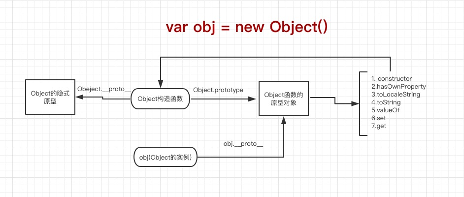

## prtotype和__proto__

说到原型，我们必须要了解prototype和__proto__,这两个很多人可能总是会分不清，接下来我会尽可能以通俗易懂的语言去解释这两者的不同。

我们看到的大多数引用类型值：函数，数组，对象都是Object的实例，所以Object可以说是一个基本。

我们去创建一个Object的实例，有两种方法，一种是通过new

例如：

	var obj = new Object()
	
还有一种通过对象字面量

	var obj = {}  
	
每个构造函数都有一个原型对象，通过prototype去访问，比如Object.prototype,然后这个原型对象包含一个constructor属性，指向构造函数，也就是Object.prototype.constructor === Object，还包含了一些内置函数，或者自定义的函数。

然后实例化这个构造函数，得到的实例，有一个__proto__属性指向构造函数的原型对象。

下面是Object的一个例子。

所以我们可以看到obj.__proto__=== Object.prototype

总结：

1. 每个函数都有prototype指向原型对象
2. 每个对象都有__protot__指向构造函数的原型对象

在js中，函数是一种特殊的对象，所以函数也有__proto__

