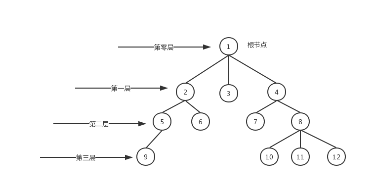

## 树数据结构的介绍

数据结构可以分为顺序数据结构和非顺序结构。顺序数据结构是指把数据元素放在地址连续的存储单元里。非顺序结构可以把数据元素任意放在连续或者不连续的存储单元里。

树是一种非顺序数据结构。族谱，公司里的组织结构都可以看成是树模型。

树结构是包含一个根节点，还有内部节点，叶子节点。根节点是位于树的顶部。叶子节点是没有后代的节点。内部节点是除了根节点和叶子节点外的所有节点。一个节点可以有祖先和后代。根节点没有祖先。

节点的深度是节点的祖先节点数。

树的高度是所有节点深度中的最大的深度。

树可以分层级，根节点在第零层，它的子节点是第一层，依次类推。

## 深度优先遍历

## 广度优先遍历

## js实现两种方式的遍历