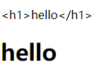
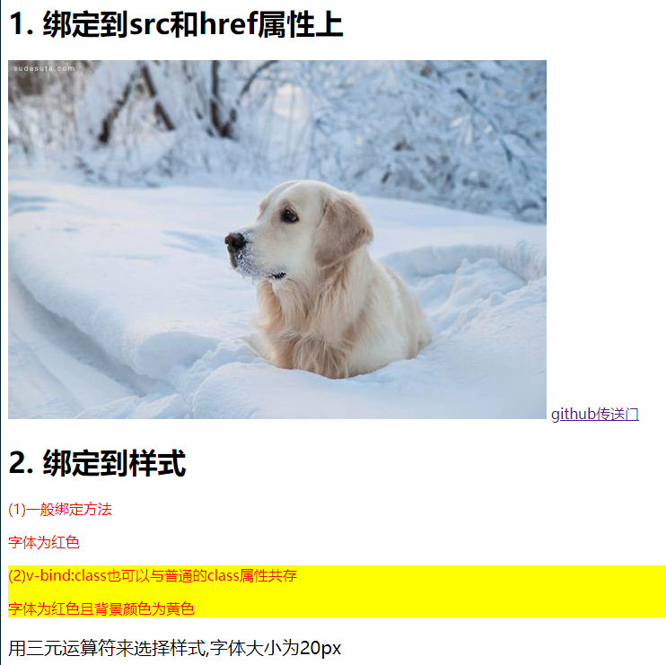
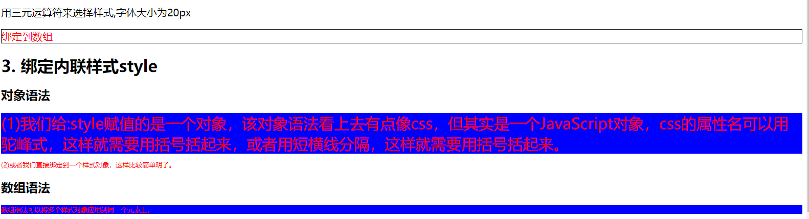
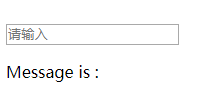

# vue指令
这章介绍的是vue的一些指令，是以“v-”开头的指令，它的值预估是单个
JavaScript表达式(v-for例外)。指令的作用是在表达式的值改变的时候，
将产生的影响，响应的作用在DOM上。<!--more-->
## v-if、v-else和v-else-if
使用场景：我们需要进行条件判断来决定这个元素是否显示的时候，就需要用到这些指令。

有v-else指令的元素必须跟在带有v-if或者v-else-if的元素后面，否则将不会被识别

使用方法：

    

        

            登陆成功       <!--param的值为true的时候-->
        

        

            请登录    <!--param的值为false的时候-->
        

    

    var vue = new Vue({
        el: "#app",
        data: {
            param: true
        }
    });

v-else-if 是在2.1.0版本新增的一个指令。学过c,c++,java语言的都应该可以理解，也就是否则如果，可以连续使用，该指令也是只能跟在v-if后面。

使用方法：

    

        

             <!--param的值为0的时候-->
        

        

             <!--param的值为1的时候-->
        

        

             <!--param的值为2的时候-->
        

        

             <!--param的值是非1，非2，非0的时候-->
        

    

    var vue = new Vue({
        el: "#app",
        data: {
            param: 0
        }
    });

## v-show和v-once

v-show指令也是用于条件展示的，用法和v-if一样，只不过没有v-else指令在后面。

不同的是带有v-show的元素是一开始就会被渲染并保留在DOM中，它是决定的是css属性display来显示或者不显示元素。而v-if是条件渲染，为真才渲染，若为假是不会渲染出相应的元素的，也就是为假的时候DOM上是找不到该元素的。

v-once顾名思义，一次性的插值。

   

此时渲染结果为 Hello!,若是后期我们把message的值改为Hello,world！,元素p里的内容还是Hello!，不会随着data里的message的改变而改变

## v-text和v-html

v-text的作用等价于两个双括号,用两个双括号不好的地方是当网速很慢或者js报错的时候，会直接显示两个双括号，但是使用v-text就不会，所以在实际开发的时候，建议使用v-text。

    

        
{{message}}
 == 

    

    var vue = new Vue({
        el: "#app",
        data: {
            message: "Hello!"
        }
    });

v-html: 会将元素当成html标签解析然后输出。

    

        

        

    

    var vue = new Vue({
        el: "#app",
        data: {
            message: "<h1>hello</h1>"
        }
    });

输出结果为：

注意： 在站点上动态的渲染任意的HTML可能会很危险，因为它很容易导致XSS攻击，所以最好慎用。

## v-bind

v-bind一般用来绑定元素属性，属性值可以是字符串，对象或数组。可以用来绑定class、style或者是图片，链接的地址属性src、href等。v-bind可以简写成“:”。

    

    

        <h1>1. 绑定到src和href属性上</h1>
            
            <a :href="url">github传送门</a>
        <h1>2. 绑定到样式</h1>
            

                
(1)一般绑定方法

                字体为红色
            

            

                
(2)v-bind:class也可以与普通的class属性共存

                字体为红色且背景颜色为黄色
            

            

                
用三元运算符来选择样式,字体大小为20px

            

            

                绑定到数组
            

        <h1>3. 绑定内联样式style</h1>
            <h2>对象语法</h2>
            

                (1)我们给:style赋值的是一个对象，该对象语法看上去有点像css，但其实是一个JavaScript对象，css的属性名可以用驼峰式，这样就需要用括号括起来，或者用短横线分隔，这样就需要用括号括起来。
            

            

                
(2)或者我们直接绑定到一个样式对象，这样比较简单明了。
            

            <h2>数组语法</h2>
            

                
数组语法可以将多个样式对象应用到同一个元素上。
            

    

    var vue = new Vue({
        el: "#app",
        data: {
            imgSrc: "http://2b.zol-img.com.cn/product/131/741/ceUvYp3mRk5w.jpg",
            url: "https://github.com/zzilcc",
            isOk: true,
            isActive: false,
            isTrue: false,
            activeClass: 'active',
            errorClass: 'text-danger',
            activeColor: 'red',
            'fd-head': 'fd-head',
            active: 'active',
            fontSize: 30,
            bgcolor: 'blue',
            styleObj1: {
                color: 'red',
                fontSize: '13px'
            },
            styleObj2: {
                position: 'relative'
            },
            styleObj3: {
                backgroundColor: 'blue'
            }
        }
    })

结果为：

## v-model

v-model指令主要用来在表单`<input>`及`<textarea>`元素上进行双向数据绑定。v-model会忽略所有表单元素的value,checked,selected特性的初始值，而总是将Vue实例的数据当做数据来源。

### 文本绑定

    

        <input v-model="message" placeholder="请输入">
        
 Message is : 

    

    var vue = new Vue({
        el: "#app",
        data: {
            message: ""
        }
    })

