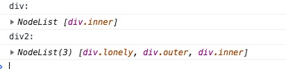

# 
DOM扩展

## 一、选择符API（重要）
平时我们写代码的时候最常用的一个操作就是根据css选择符选择与某个模式匹配的DOM元素，比如$("css选择符")。但是用jquery的话我们必须引用jquery库。现在我们可以不需要引js库就可以实现这个功能。

选择符API的核心是两个方法：querySelector()和querySelectorAll()。还有一个matchesSelector()方法。

Document、Element，DocumentFragment三种类型的元素都有这两个方法。
<!--more-->
兼容性(2018.09.04查询)

### 1. querySelector()

该方法接收一个css选择器，返回与该模式匹配的第一个元素，如果没有找到匹配的元素，则会返回null。如果传入了不被支持的选择符，会报错。

通过Document类型调用该方法，会在文档元素的范围内查找匹配的元素。而通过Element类型调用，只会在该元素后代元素范围内查找匹配的元素。

`html`
	
	outside
    

    		my-id outside
         inside
         
lonely

         

              
inner

         

    

Document

`js`

	var lonely = document.querySelector("#my-id .lonely");
    var outside1 = document.querySelector("#outside1"); //null
    var inside = document.querySelector("#.inside");//报错
    
    
结果：

Element

	var myId = document.querySelector("#my-id");
    var outer = myId.querySelector(".outer");
    var outside = myId.querySelector(".outside");

### 2.querySelectorAll()
该方法接收的参数也是一个css选择符，返回的是一个NodeList的实例，返回的是所有匹配的元素而不仅仅是返回的一个元素。

NodeList 对象是一个节点的集合，是由 Node.childNodes 和 document.querySelectorAll 返回的.

大多数情况下，我们使用Node.childNodes返回的NodeList是一个实时的集合，也就是页面节点又变化是，NodeList会跟着改变。

	var myId = document.querySelector("#my-id");
    var childNodes = myId.childNodes; //9
    myId.appendChild(document.createElement('div'));
    var childNodes2 = myId.childNodes;//10
    
 
 
 
querySelectorAll()返回的是一个静态的nodeList，是一个快照。这样可以避免使用NodeList对象通常会引起的大多数性能问题。

	var myId = document.querySelector("#my-id");
    var nodes = document.querySelectorAll("div");
    console.log("nodes:");
    console.log(nodes);
    myId.appendChild(document.createElement('div'));
    var nodes2 = document.querySelectorAll("div");
    console.log("nodes2:");
    console.log(nodes2);
    console.log("nodes:");
    console.log(nodes);
    

   
 只要传给querySelectorAll()方法的css选择符有效，该方法都会返回一个NodeList对象，如果没有找到匹配的元素，NodeList就是空的。  
 
	var aNodes = document.querySelectorAll("a");   
	console.log("aNodes");
	console.log(aNodes);

	
思考：下面两个获取方法得到的内容是一样的么？

	var div = document.querySelectorAll("#my-id div div");
	console.log("div:");
    console.log(div);
	var div2 = document.querySelector("#my-id").querySelectorAll("div div");
	console.log("div2:");
    console.log(div2);
    

原因：CSS选择器是独立于整个页面的！

这里的querySelectorAll里面的选择器也同样是这也全局特性。document.querySelector("#my-id").querySelectorAll("div div")翻译成白话文就是：查询#my-id的子元素，同时满足整个页面下div div选择器条件的DOM元素们。

使用场景？

### 3.matchesSelector（）方法

这个方法接收一个参数，css选择符，如果调用元素与该选择符匹配，返回true，否则为false。

if(document.body.webkitMatchesSelector("body")){
        console.log("webkitMatchesSelector");
    }
 
## 二、元素遍历
 对于元素间的空格，IE9及之前的版本不会返回文本节点，这样就导致了在使用childNodes和firstChild等属性时行为不一致。
 
 所以Element Traversal API 为DOM元素添加了以下5个属性。
 
 childElementCount： 返回子元素（不包括文本节点和注释）的个数
 
 firstElementChild：只想第一个子元素
 
 lastElementChild： 指向最后一个元素
 
 previousElmentSlibling：指向前一个同辈元素
 
 nextElementSibling：指向后一个同辈元素

## 三、HTML5（重要）
### 1.与类相关的扩充
1. getElementsByClassName()
	该方法接收一个参数，即包含一或多个类名的字符串，返回带有指定类的所有元素的NodeList。类名的先后顺序无所谓。
	
2. classLists属性

		
2222

	
		var dd = document.querySelector("#dd");
		console.log(dd.classList);

add(value): 将给定的字符串添加到列表中，如果值有，就不添加

contains(value): 表示列表中是否存在给定的值，如果存在则返回true，如果不存在false

remove(value):从列表中删除给定的字符串

toggle(value):如果列表中已经存在给定的值，删除它，如果列表中每一给定的值，添加它。

### 2 自定义数据属性
html5规定要添加非标准的属性，但是要加前缀data-，目的是为元素提供与渲染无关的信息，或者提供语义信息

例如：

	

	
t添加了自定义属性后，我们可以通过元素的dataset属性来访问自定义属性的值

	
### 3.插入标记
使用场景：

我们需要给文档插入大量新的标记，我们不仅要创建一系列DOM节点，然后还要小心的按照正确的顺序把他们连接起来。

#### a：innerHTML属性
	
在读模式，innerHTML属性返回与调用元素的所有子节点（包括元素，注释和文本节点）对应的HTML标记。

在写模式，innnerHTML会根据制定的值创建新的DOM树，然后用这个DOM树完全替换调用元素原先的所有子节点。

	

        
hello

        <ul>
            <li>item 1</li>
            <li>item 1</li>
            <li>item 1</li>
         </ul>
     

	
	var innerHTML = document.querySelector("#content").innerHTML;
    console.log(innerHTML);
	
返回的是
	
		
hello

            <ul>
                <li>item 1</li>
                <li>item 1</li>
                <li>item 1</li>
            </ul>
 
 写模式：
            
 	document.querySelector("#content").innerHTML = "
hello,world
";  
  	var innerHTML = document.querySelector("#content").innerHTML;
  	console.log(innerHTML);//
hello,world

  	
并不是所有元素都支持innerHTML属性，不支持的有：	
	`<col`>,`<colgroup`>,`<frameset>`,`<head>`,`<html>`,`<style>`,`<table>`,`<tbody>`,`<thead>`,`<tfoot>`,`<tr>`
	
#### b: outerHTML
在读模式，outerHTML返回调用它的元素及所有子节点的HTML标签，在写模式下，outerHTML会根据制定的HTML字符串去创建新的DOM子树，然后用这个DOM树去完全替换调用元素。
#### c：内存与性能问题
我们在使用这两个属性时，可能删除了之前的元素，元素上有一个事件处理程序，从文档树中删除了元素，但是元素与事件处理程序之间的绑定关系在内存中并没有删除，这样日积月累，页面占有的内存会越来越多，所以我们使用上面的方法时最好手动删除要被删除的元素的事件处理程序和js对象属性。

	
### 4.scrollIntoView()
为了方便开发人员更好的控制页面滚动，HTML5选择了scrollIntoView()作为标准方法。

scrollIntoView()可以在所有HTML元素上调用，通过滚动浏览器窗口或者某个容器元素，调用元素就会出现在视口中。如果给这个方法传入true作为参数，或者不传入参数，那么窗口滚动之后会 让调用元素的顶部与视口顶部尽可能齐平。如果传入false作为参数，调用元素会尽可能全部出现在视口中，可能的话调用元素的底部会与视口底部齐平。

移动端开发可能用的比较多，input和键盘。
