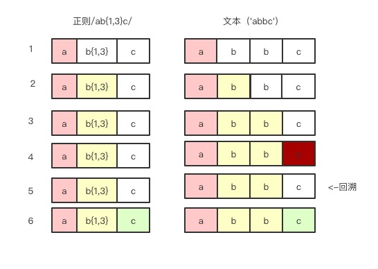

# 一、 为什么用正则表达式

我们去学习某个新技能，肯定是因为它有某些实用价值，它能解决某些问题，能提高某些方面效率。

正则表达式也是如此。

正则表达式是匹配模式，

正则表达式能做的事情：

1. 验证
	* 表单验证
2. 切分
	* “2019-05-25这一天，我们去密室逃脱.”切分出日期
	* 切分出url的参数
3. 提取
	* ”2019-05-28“提取出年月日
4. 替换
	* 替换空格等

总的来说，正则表达式可以用来匹配字符，也可以匹配位置，可以使我们少写很多行代码。
<!--more-->
[知道这20个正则表达式，能让你少写1,000行代码](https://www.jianshu.com/p/e7bb97218946)

>​ “如果罗列计算机软件领域的伟大发明, 我相信绝对不会超过二十项, 在这个名单当中, 当然应该包括分组交换网络, Web, Lisp, 哈希算法, UNIX, 编译技术, 关系模型, 面向对象, XML这些大名鼎鼎的家伙, 而正则表达式也绝对不应该被漏掉.

​ 对很多实际工作而言, 正则表达式简直是灵丹妙药, 能够成百倍的提高开发效率和程序质量, 正则表达式在生物信息学和人类基因图谱的研究中所发挥的关键作用, 更是被传为佳话. CSDN的创始人蒋涛先生在早年开发专业软件产品时, 就曾经体验过这一工具的巨大威力, 并且一直印象深刻.”
奔着能少写代码，精简代码，我们开始学习正则表达式

# 二、 正则表达式是什么

> 百度百科： 正则表达式，又称规则表达式。（英语：Regular Expression，在代码中常简写为regex、regexp或RE），计算机科学的一个概念。正则表达式通常被用来检索、替换那些符合某个模式(规则)的文本。

正则表达式是由普通字符和特殊字符(也叫元字符或限定符)组成。

然后由'//'两个斜杠包裹着

比如我们要匹配'hello', 可以写/hello/

  var regex = '/hello/';
  console.log(regex.test("hello,world!")) // true

这是最简单的精确匹配，但是正则表达式能做的不止这些，主要的还是模糊匹配。

模糊匹配有两种： 横向模糊匹配和纵向模糊匹配。

## 横向模糊匹配

横向模糊是指一个正则匹配的字符串的长度不是固定的，可以是多种情况的。

譬如： 删除字符串首尾空格（后面会写该正则）

字符串首尾空格的个数我们是不知道的，所以我们要用到量词{n,m}，代表字符重复次数在n到m次。

/ab{2,5}c/表示匹配这样的一个字符串，第一个字符是’a‘，然后是2到5个字符’b‘，最后是’c‘

	var reg = /ab{2,5}c/g
	var str1 = "abc abbc abbbc abbbbc abbbbbc abbbbbbc"
	var str2 = 'abcabcabbc'
	console.log(str1.match(reg))
	console.log(str2.match(reg))
	
## 纵向模糊匹配

纵向模糊是指一个正则匹配的字符串，具体到某一位字符时，它可以是不确定的字符，可以有多种可能。

譬如 [0123456789]指可以是0-9其中的一个字符，注意是一个。

/123[abc]/可以匹配’123a‘，’123b‘，’123c‘

	var reg = /123[abc]/g
	var str1 = "123a 123b 123c"
	console.log(str1.match(reg))

## 字符组（字符类）

可以理解成匹配这一组字符里的其中一个，虽然叫组，但是只是其中一个字符，注意不要混淆。

我们刚刚举例过的[abc]就是一个字符组，表示'a','b','c'的其中一个。

如果字符组里的字符很多，比如所有数字和大小字母，[0123456789abcd...zA....Z]我们可以写成[0-9a-zA-Z]，通过连字符'-'代表范围。

那么我们要匹配’a‘,'-','z'呢？

我们可以写成[az-],[-az],[a\-z]。

然后系统对于一些常见的字符组定义了一些符号去表示：（^表示取反）

字符组|具体含义
|:-:|:-:|
|\d|表示[0-9]数字|
|\D|表示[^0-9]非数字|
|\s|表示空白符，包括空格，水平制表符，垂直制表符，换行符，回车符，换页符|
|\S|表示非空白符|
|\w|[0-9a-zA-Z_]表示单词字符,包括数字，大小写字母还有下划线|
|\W|[^0-9a-zA-Z_]表示非单词字符|
|.|通配符，几乎表示任意字符，换行符，回车符，行分隔符，段分隔符除外|

思考： 怎么匹配任意字符？

## 量词

量词可以理解成重复次数，在正则中用{n,m}表示。

量词|具体含义
|:-:|:-:|
|{n,m}|表示出现n到m次|
|{n}|表示只能出现n次|
|{n,}|表示至少出现n次|
|{,m}|表示至多出现m次|
|?|等价于{0,1}|
|+|等价于{1,}|
|*|等价于{0,}|

	var reg = /a{1,8}b{2,}c{4}d?e+h*/g
	var str1 = "abbbccccc abbbccccde"
	console.log(str1.match(reg))	

## 贪婪匹配

	var reg = /\w{1,4}/g
	var str1 = "a 12a 22 aaaa adkdd 123dff"
	console.log(str1.match(reg))
	
	
结果我们可以看到是["a", "12a", "22", "aaaa", "adkd", "d", "123d", "ff"]，从结果中我们可以看到，结果是尽量去匹配的，给我5个字符，我能要到四个，给我四个，我也能要到四个，给3个，我也要三个。这在正则中叫做贪婪匹配，也就是尽可能的匹配。

## 懒惰匹配

懒惰匹配只需要在量词后面加上'?'

1. {n,m}?
2. {n}?
3. {n,}?
4. {,m}?
5. ??
6. +?
7. *?

	var reg = /\w{1,4}?/g
	var str1 = "a 12a 22 aaaa adkdd 123dff"
	console.log(str1.match(reg))

结果为：["a", "1", "2", "a", "2", "2", "a", "a", "a", "a", "a", "d", "k", "d", "d", "1", "2", "3", "d", "f", "f"]

## 多选分支

多选分支的形式:(a|b)

a，b是子模式，用管道符'|'分隔，表示匹配其一。

比如要匹配hello或者hi 可以/hello|hi/

	var reg = /hello|hi/g
	var str = 'hello,girl.hi,boy'
	console.log(str.match(reg)) // ["hello", "hi"]
	
其实多选分支其实是惰性的，比如我们用/hello|helloworld/去匹配‘helloworld’,结果是
	
	var reg = /hello|helloworld/g
	var str = 'helloworld'
	console.log(str.match(reg)) //hello
	
它匹配到了'hello',就不会继续去匹配'helloworld' 

## 正则表达式回溯原理法

比如正则表达式是/ab{1,3}c/ str=”abbc“

可以看到第1步我们匹配'a'，匹配成功了，然后下面到匹配'b{1,3}',也就是1到3次的b,由于这是贪婪匹配,然后第2，3步正常匹配到了'b'，然后往下一步要找最后一次'b',但是发现是'c',所以没有匹配成功，这时候回溯，然后开始匹配'c'，去匹配'c'，匹配成功。

第5步就是回溯。

> 回溯法也称试探法，它的基本思想是：从问题的某一种状态（初始状态）出发，搜索从这种状态出发
所能达到的所有“状态”，当一条路走到“尽头”的时候（不能再前进），再后退一步或若干步，从
另一种可能“状态”出发，继续搜索，直到所有的“路径”（状态）都试探过。这种不断“前进”、
不断“回溯”寻找解的方法，就称作“回溯法”。
— 百度百科

那么当多个贪婪量词挨着，并互相有冲突，那么会怎么样？

var string = "12345";
var regex = /(\d{1,3})(\d{1,3})/;
console.log( string.match(regex) ); //["12345", "123", "45", index: 0, input: "12345"]

我们可以看到是谁先谁‘贪’的更多，因为回溯的本质是深度优先算法，所以会先满足前面的。

## 位置匹配

> 正则表达式是匹配模式，要么匹配字符，要么匹配位置。 -老姚

位置包括

1. 多行开头'^'
2. 多行结尾'$'
3. 单词边界'\b'
4. 非单词边界'\B'
5. (?=p)p是子模式，该正则表达式表示p前面的位置
6. (?!p)与(?=p)相反。

比如我们在字符串的开头和结尾加上'@'

	var reg = /^|$/g
	var str = 'hello,world'
	var result = str.replace(reg,'@')
	console.log(result)// @hello,world@
	
我们在单词边界加上'@'

	var reg = /\b/g
	var str = 'hello,world'
	var result = str.replace(reg,'@')
	console.log(result) //@hello@,@world@
	
我们在非单词边界加上'@'

	var reg = /\B/g
	var str = 'hello,world'
	var result = str.replace(reg,'@')
	console.log(result) // h@e@l@l@o,w@o@r@l@d
	
我们在'l'前面加上'@'

	var reg = /(?=l)/g
	var str = 'hello,world'
	var result = str.replace(reg,'@')
	console.log(result) // he@l@lo,wor@ld
	
我们在非'l'的前面加上'@'

	var reg = /(?!l)/g
	var str = 'hello,world'
	var result = str.replace(reg,'@')
	console.log(result) // h@ell@o@,@w@o@rl@d@
	
## 括号

括号最大的作用是分组，用来匹配子表达式，

比如匹配12个月，01-12，我们可以分成两种情况。第一种情况：第一个数字0开头的话，第二个数字可以是1-9，然后第二种情况，第一个数字1开头的话，只有0-2

所以正则表达式为: /(0[1-9])|(1[0-2])/

### 第一次课堂作业

1. 数字的千位分隔符表示法。比如‘12345678’变成‘12,345,678’

<a href="#第一次课堂作业答案">第一次课堂作业答案</a>

### 第二次课堂作业

1. 匹配16进制颜色值
2. 匹配时间（例如23:22）
3. 匹配日期（例如2019-06-10）

<a href="#第二次课堂作业答案">第二次课堂作业答案</a>

# 三、 怎么使用正则表达式

## JavaScript 正则

### RegExp

js通过RegExp类型支持正则

var reg = new RegExp("[bc]at", "i")

上面代码等价于 var reg = /[bc]at/i

'i'（不区分大小写）是正则表达式的标志，还有'g'（全局模式）,'m'(多行模式)

一个正则表达式可以带多个标志

	/[bc]at/ig

我们上面所接触到的特殊字符`({\^$|?+.})`，叫做元字符，我们如果要匹配元字符的话需要进行转义。

	匹配第一个'[bc]at'，不区分大小写
	var reg = /\[bc\]/i
	
#### exec

	语法  reg.exec(str) 返回值：包含第一个匹配项信息的数组，或者null

	var str = "mom and dad and baby"
	var reg = new RegExp("mom( and dad( and baby)?)?", "gi")
	var res = reg.exec(str)
	console.log(res)
	// ["mom and dad and baby", " and dad and baby",
	 " and baby", index: 0, input: "mom and dad and baby", groups: undefined]
	
exec返回数组的第一项是匹配的整个字符串，然后第二项是第一个捕获组匹配的内容，第三项是第二个捕获组匹配的内容，然后是index属性，为0是因为整个字符串本身和模式匹配。

	var str = "m  mom and dad and baby"
	var reg = new RegExp("mom( and dad( and baby)?)?", "gi")
	var res = reg.exec(str)
	console.log(res)
	// ["mom and dad and baby", " and dad and baby", 
	" and baby", index: 2, input: "  mom and dad and baby", groups: undefined]

因为是第三个字符匹配，所以index2

#### test

	语法 reg.test(str) 返回值为布尔值 true和false

功能： 判断某个字符串是不是匹配某个正则

	var str = "m  mom and dad and baby"
	var reg = new RegExp("mom( and dad( and baby)?)?", "gi")
	var res = reg.test(str)
	console.log(res) // true

### String

#### match(reg)

	语法
	str.match(str1)
	str.match(regexp)
	返回值和exec函数类似
	
	
match()函数有两种参数，第一种是某个字符串str1，去str匹配有没有str1

	var str = "hello"
	var str1 = "he"
	var res = str.match(str1)
	console.log(res)
	//["he", index: 0, input: "hello", groups: undefined]
	
第二种参数是正则表达式

	var str = "m  mom and dad and baby"
	var reg = new RegExp("mom( and dad( and baby)?)?", "i")
	var res =str.match(reg)
	console.log(res)
	//["mom and dad and baby", " and dad and baby", 
	" and baby", index: 3, input: "m  mom and dad and baby", groups: undefined]
	
	
#### search

	语法
	str.search(regexp) 如果匹配成功，会返回匹配成功的位置 ，如果匹配失败，则返回-1
	
	var str = "hello,world"
	var reg = /world/i
	var res = str.search(reg)
	console.log(res)// 6
	var res1 = str.search(/hi/i)
	console.log(res1) // -1
	
注意： search方法会忽略全局标'g'

#### replace

replace() 方法用于在字符串中用一些字符替换另一些字符，或替换一个与正则表达式匹配的子串。

	语法 str.replace(regexp/substr,replacement) 返回值为一个新字符串
	
	var str = "hello,world"
	var reg = /he/
	var res = str.replace(reg,'@')
	console.log(res) // @llo,world

replacement 可以是字符串，也可以是函数。如果它是字符串，那么每个匹配都将由字符串替换。但是 replacement 中的 $ 字符具有特定的含义。

#### split

<a name="第一次课堂作业答案">第一次课堂作业答案</a>

1. /(?=(\d{3})+$)/g

<a name="第二次课堂作业答案">第二次课堂作业答案</a>

1. 匹配16进制 /#([0-9a-fA-F]{6}|[0-9a-fA-F]{3})/g
2. 匹配时间 /([01][0-9]|[2][0-3]):[0-5][0-9]/g
3. 匹配日期 /[0-9]{4}-(0[1-9]|1[0-2])-(0[1-9]|[12][0-9]|3[01])/g