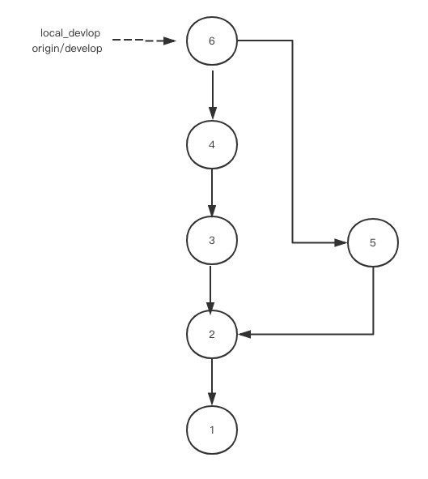

# 变基(git rebase)中的基是什么？
git rebase 在官网中的定义是：重新应用commits到要合并到的分支的顶端。（一个英语渣的直译，见笑了）。其实也可以这么说是重新应用commits到要合并到的分支的最新提交。如果现在还没有理解，没有关系，现在我开始仔细说明git rebase都干了什么。

假设我们现在是A研发人员，此时本地分支是master,然后远程有两个分支：origin/master,origin/develop。此时我们接到一个任务，我们要在develop分支上开发一个功能，所以此时我们要切换分支。
<!--more-->

 
切换分支我们需要用到的命令是：

	git checkout -b local_develop origin/develop
	
该命令其实做了两个操作，第一个是拷贝了远程的origin/develop到本地，致使本地多了一个分支，第二个是把该分支命名为local_develop。

假设此时远程的origin/develop分支上已经有两个提交。，所以我们查看远程分支的日志（git log origin/develop）可以看到提交的树状图如下：

此时你本地的提交日志（git log）的树状图如下：

经过一段时间，你把功能开发完成了，此时提交代码(git commit -m "[+]添加功能")，把你本地的代码提交到远程分支上。这时候你发现在你提交之前，有其他的同事在develop分支（这里指的是origin/develop）上提交了两次代码。所以此时的树状图是这样的：远程分支的提交已经有四次了，此时你的提交编号应该为5.

commit后，如果有修改过但是未commit的文件，我们应该执行驻藏命令 git stash 将这些文件保留到驻藏区，然后进行代码的拉取git fetch ，然后执行合并分支，git rebase. 

该命令会执行两个步骤，第一个是把你本地分支的新添加的全部的commit的补丁（patch）,我理解为是备份，也就是把他们的备份临时放到.git/rebase目录下，然后把commit撤销掉。
也就是这样：

第二个步骤是在要合并到的分支（origin/develop）的最新的commit的基础上应用这些补丁。也就是把4和5'进行合并，然后推送代码 git push.

到这里，我们可以知道变基的基是什么了吧。就是要要合并到的分支（origin/develop）的最新的提交（在上面例子里，这个基就是4）。

明白了git rebase的操作后，我们可以发现，如果使用git rebase命令来合并分支的话，分支的树状图都是“单线”，都是一条直线。这样的树状图是非常优美的。

现在我们也可以来了解一下另一个合并分支的命令(git merge).

merge命令非常简单粗暴，就是把你本地最新的提交和远程最新的提交合并一下，得到一份最新的提交。

用merge命令的话树状图就会看着很乱，有各种线交叉，看着非常不友好。

所以拉代码推荐git fetch + git rebase.

