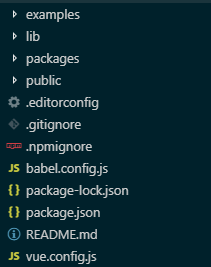
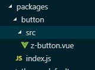
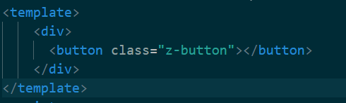
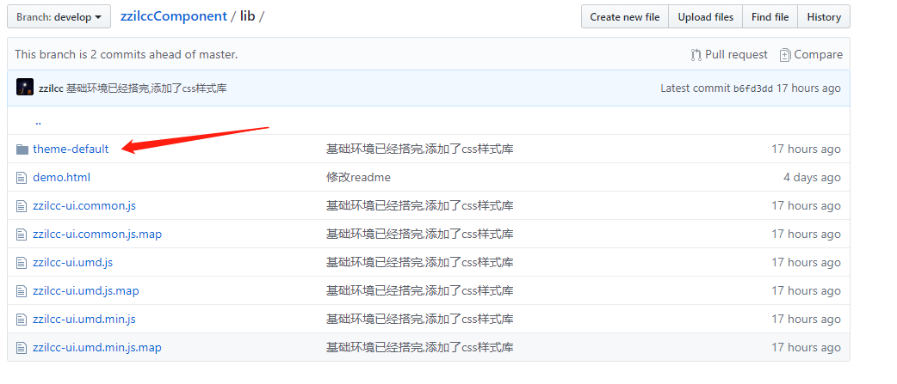
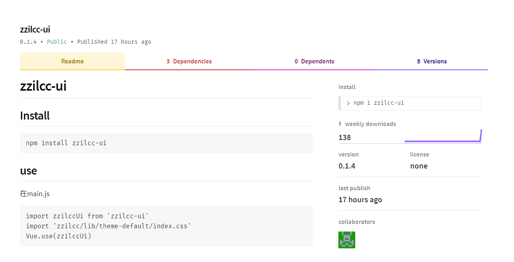

## 前言

## 安装vue-cli3.0

因为我电脑之前有装了vue-cli2的，所以要先卸载以前的版本，再安装新的版本。

	npm uninstall vue-cli -g
	
然后再安装新版本

	npm install -g @vue/cli 
	
安装成功后用`vue -V`查看，发现还是2.9.x版本，我看了一下node版本是符合要求的，然后我真是的一脸懵逼。然后网上搜了下，最后找到了一个解决办法（window系统有遇到这个问题，mac没有）。

1. 把node完全卸载了，文件也删除干净。
2. 然后下载nvm，[下载传送门](https://github.com/coreybutler/nvm-windows/releases)，选择相应的版本，然后选择下载nvm-setup.zip这个包，然后安装成功后，命令行输入nvm，会出现nvm版本号和一系列指令。
3. 命令行输入 `nvm install node版本号`,就可以安装相应版本的node,最后`nvm use node版本号`使用指定版本的node
4. 最后在命令行输入`npm install -g @vue/cli `，发现输出终于是3.x了，欢呼！！

<!--more-->

## 创建github项目

为了后期维护，我把代码上传到了github上，[项目地址](https://github.com/zzilcc/zzilccComponent/tree/develop),具体怎么上传到github请自行搜索。

代码上传后默认是提交到master分支，我们拉一个develop分支，在该分支上进行开发。

## 项目结构

### 创建项目

vue-cli3.0是通过 `create`创建，跟2.0是有区别。

	vue create zzilcc-ui

通过上面的命令，我们创建了一个新的项目。

运行`npm run serve`就能把项目起起来。

### 调整目录
我们需要一个目录存放示例，一个目录存放真的组件代码，所以我们将原先的src目录改名成examples，然后新增一个packages目录，用来放组件代码。

所以调整后的目录是这样的




## 配置

### 重新配置入口为example/main.js
因为我们刚把src目录改成了example，所以我们要修改一下项目的入口文件的路径，我们创建在根目录下创建一个vue.config.js文件。

```js
module.exports = {
	pages: {
		index: {
			entry: 'examples/main.js', // 修改src目录为examples
			template: 'public/index.html',
			filename: 'index.html'
		}
	}
}

```

### 支持对packages目录的支持

packages是我们新增的，我们需要手动配置，要不然webpack是不会处理。

```js
module.exports = {
	pages: {
		index: {
			entry: 'examples/main.js', // 修改src目录为examples
			template: 'public/index.html',
			filename: 'index.html'
		}
},
	// 扩展webpack位置，让packages加入编译
	config.module
		.rule('js')
		.incluede
			.add('packages')
			.end()
		.use('babel')
			.loader('babel-loader')
			.tap(options => {
				// 修改它的选项
				return options
			})
}
```

## 编写组件

### 创建一个新组件

	1. 我们在packages目录下创建一个button文件夹，每个组件都一个文件夹
	2. 在button文件夹下创建src文件夹，用来存放组件源码，并在src文件夹里创建一个z-button.vue
	3. 在button文件里创建一个index.js,用来对外提供组件的引用



为了测试，我们在z-button.vue的template里写一个`<button>`



然后再button/index.js里写组件的install方法，创建相应的组件方法，供外部调用。

```js
	// 导入组件，组件必须声明name
	import zButton from './src/z-button.vue'
	// 为组件提供install方法，供按需引入
	zButton.install = function (Vue) {
		Vue.component(zButton.name, zButton)
	}
	// 默认导出组件
	export default zButton
```
	
### 整合所有组件，对外导出

修改packages/index.js

```js
// 导入z-button组件
import zButton from './button'
// 存储组件列表
const components = [
	zButton
]
// 定义 install 方法，接收 Vue 作为参数。如果使用 use 注册插件，则所有的组件都将被注册
const install = function (Vue) {
	// 判断是否安装
	if (install.installed) return
	// 遍历注册全局组件
	components.map(component => Vue.component(component.name, component))
}
// 判断是否是直接引入文件
if (typeof window !== 'undefined' && window.Vue) {
	install(window.Vue)
}
export default {
	// 导出的对象必须具有 install，才能被 Vue.use() 方法安装
	install,
	// 以下是具体的组件列表
	zButton
}
```

## 创建主题样式

因为第一次建组件库，没什么经验，然后借鉴了好多ui组件库，比如element ui,iView,VV-UI等，我看到他们都没有在组件vue文件中去写相应的样式，也没有显示调用样式文件，然后研究了一下element ui的，发现它是将样式所有抽离出来，用gulp打包编译。然后我们在项目中需要引用样式文件。

### 创建一个github新项目

我创建了一个名为theme-default的github项目用来存放主题样式。然后得到了一个项目地址。

### 创建样式文件目录
我们在packages/下新建一个样式目录，叫做‘theme-default’，这个名字你可以随意。

### 初始化样式文件

我们通过`npm init`初始化，然后命令行会出现一些内容让你填写，比如name,main,author等，关于git项目的选项，我们要填上第一步创建的github项目地址，然后结束后在theme-default目录下会出现package.json,里面的内容就是你刚刚填写的。

我们在样式目录下新建一个src目录用来放置样式文件，然后在src目录下创建button.scss,和index.scss.

然后安装一下scss/sass

	npm install -D sass-loader node-sass

在button.scss里先写

```css
.z-button {
	display: inline-block;
	background: #fff;
	cursor: pointer;
	border: 1px solid #eee;
	font-size: 14px;
}
```


在index.scss

```css
@import "./button.scss"
```

## 安装gulp
下面的命令都是在theme-default目录下执行

全局安装：

	npm install --global gulp

作为项目的开发依赖（devDependencies）安装：

	npm install --save-dev gulp

在theme-default目录下创建一个gulpfile.js，在改文件中编写

```js
'use strict'

const { series, src, dest } = require('gulp')
const sass = require('gulp-sass')
const autoprefixer = require('gulp-autoprefixer')
const cssmin = require('gulp-cssmin')

function compile () {
	return src('./src/*.scss')
		.pipe(sass.sync())
		.pipe(autoprefixer({
			browsers: ['ie > 9', 'last 2 versions'],
			cascade: false
		}))
		.pipe(cssmin())
		.pipe(dest('../../lib/theme-default')) // 这是输出地址，我写到了和组件编译后的地址
}

function copyfont () {
	return src('./src/fonts/**')
		.pipe(cssmin())
		.pipe(dest('../../lib/fonts/theme-default'))// 同上
}

exports.build = series(compile, copyfont)
```
## 发布到npm

###  配置命令
我们在zzilcc-ui目录下的package.json的scripts里加一个lib命令

```json
	"scripts": {
		"serve": "vue-cli-service serve",
		"build": "vue-cli-service build",
		"lint": "vue-cli-service lint",
		"lib": "vue-cli-service build --target lib --name zzilcc-ui --dest lib packages/index.js && gulp build --gulpfile packages/theme-default/gulpfile.js"
	},
```

然后运行lib命令  `npm run lib`

该命令其实执行了两个命令，第一个是vue-cli3.0的vue-cli-service build

```
用法：vue-cli-service build [options] [entry|pattern]
选项：

--mode        指定环境模式 (默认值：production)
--dest        指定输出目录 (默认值：dist)
--modern      面向现代浏览器带自动回退地构建应用
--target      app | lib | wc | wc-async (默认值：app)
--name        库或 Web Components 模式下的名字 (默认值：package.json 中的 "name" 字段或入口文件名)
--no-clean    在构建项目之前不清除目标目录
--report      生成 report.html 以帮助分析包内容
--report-json 生成 report.json 以帮助分析包内容
--watch       监听文件变化
```

vue-cli-service build 会在 dist/ 目录产生一个可用于生产环境的包，带有 JS/CSS/HTML 的压缩，和为更好的缓存而做的自动的 vendor chunk splitting。 --vue-cli官网

第二个命令是执行样式文件的gulp build

命令执行完后会在zzilcc-ui下生成一个lib文件



箭头指向的是生成主题样式文件，然后是html，和压缩后的js

### 配置 package.json 文件中发布到 npm 的字段

1. name: 包名，该名字是唯一的。可在 npm 官网搜索名字，如果存在则需换个名字。我第一个名的名字叫"zzilccComponent"发布失败了，改成"zzilcc-component"才可以，不知道是不是大写不行
2. version: 版本号，每次发布至 npm 需要修改版本号，不能和历史版本号相同。
3. description: 描述。
4. main: 入口文件，该字段需指向我们最终编译后的包文件。
5. keyword：关键字，以空格分离希望用户最终搜索的词。
6. author：作者
7. private：是否私有，需要修改为 false 才能发布到 npm
8. license： 开源协议

贴上我的配置

```json
"name": "zzilcc-ui",
"version": "0.1.4",
"description": "基于 Vue 的简易组件库",
"main": "lib/zzilcc-ui.umd.min.js",
"keyword": "zzilcc-ui vue",
"private": false,
```

### 添加npm发布忽略文件

我们在zzilcc-ui目录下新建一个.npmignore文件，语法和git的忽略文件是一样的，内容如下
```
# 忽略目录
examples/
packages/
public/

# 忽略指定文件
vue.config.js
babel.config.js
*.map
```

### 注册npm账号

去[npm官网](https://www.npmjs.com/package/npm)注册一个账号，然后网站会发一封邮件到你注册的邮箱，点击邮件中的链接，就表示邮箱验证成功。

然后在zzilcc-ui目录打开命令行输入

	npm login

该命令会让你输如npm 账号，密码，邮箱，相应的输入你注册的账号，密码输入不会显示，输入完回车就行

### 发布你的第一个npm包

最后我们只要执行发布命令

	npm publish

成功后，去npm官网上搜索你写的npm name，搜到你相应的包就算成功了。



## 结束语

下一篇文章我将会细讲怎么写一个组件，今天只是把环境搭好，有什么疑惑可以到[issues](https://github.com/zzilcc/zzilccComponent/issues)给我提问。要是觉得我写的还行，能帮助到你，也可以给我github项目star一下。

打赏植发钱

一入前端发直掉，

网络一线牵，

珍惜这段缘。

感觉要开始存钱植发了。


