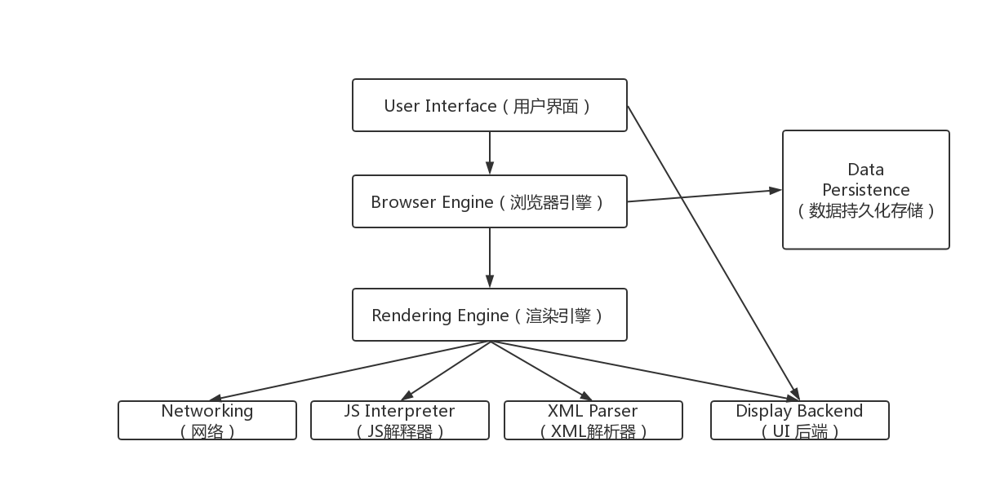
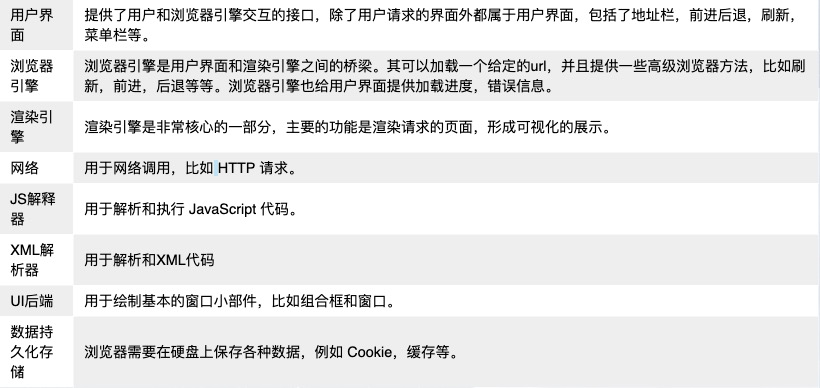
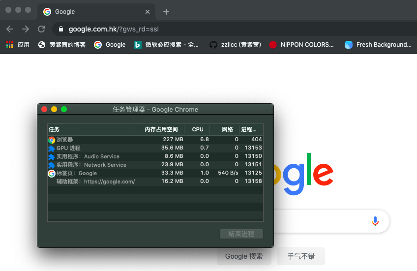
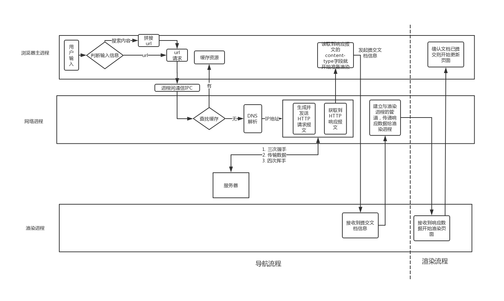
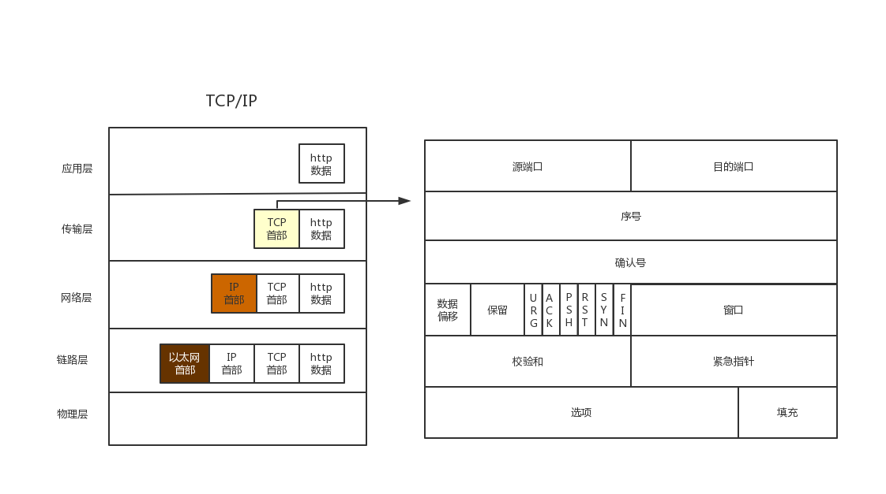
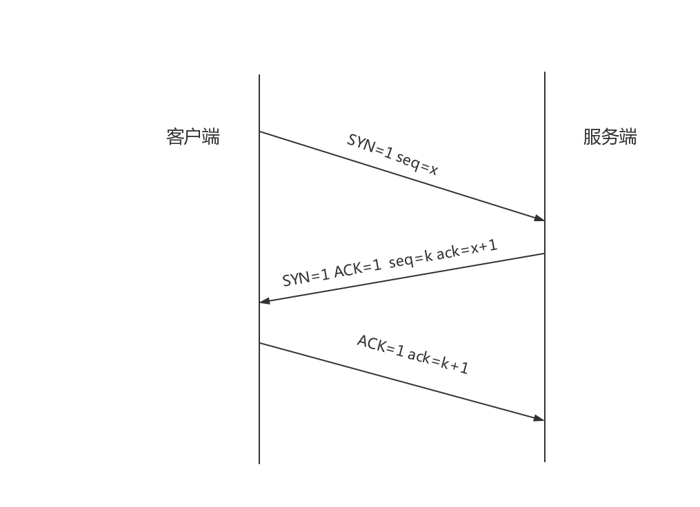
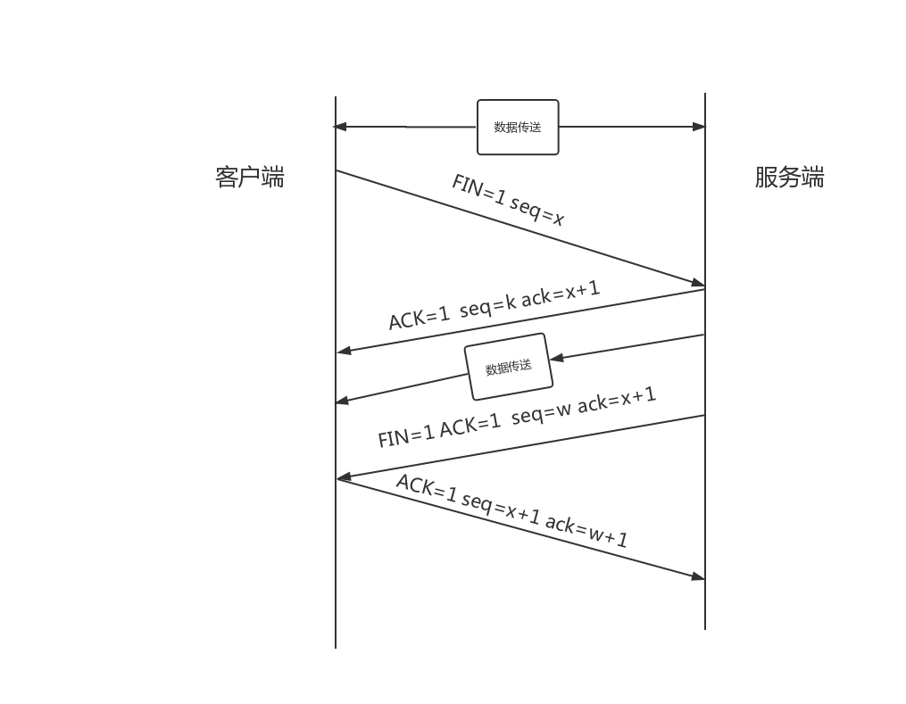
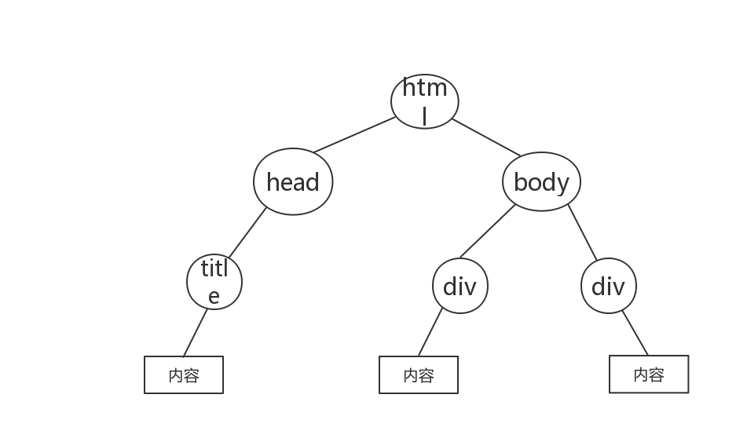
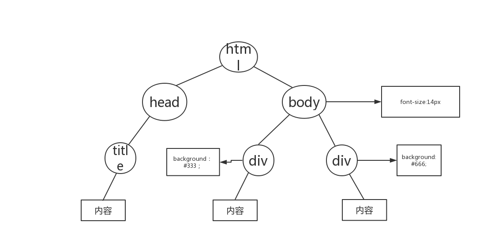
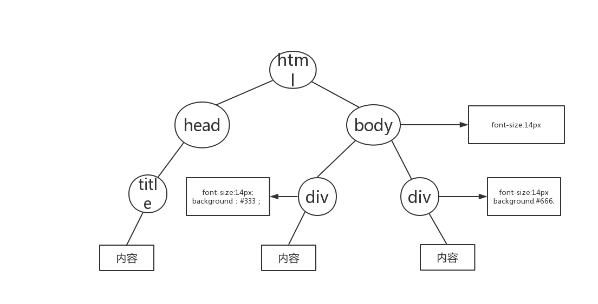

## 前言

工作了一年多，发现自己其实学习路线是存在问题的，刚开始学习前端就是直接学习着三个基础HTML，CSS,JavaScript，然后就学习框架vue，然后vue脚手架，vuex，路由，webpack这些。

从来没有考虑过本质，比如浏览器的运行，渲染机制，浏览器怎么和服务器通行等等。所有的认知都只是停留在表面。

所以意识到自己的短板后，开始深入学习。

<!--more-->

## 浏览器组成

首先我们要知道浏览器的组成。我们知道不同浏览器具体实现是有不同的，但是它们设计思想是一样的，所以可以将浏览器抽象成下面的图。

## 浏览器历史

在2007年前大多数浏览器都是单进程的，也就是所有功能都运行在一个进程中。那时候浏览器需要借助插件去实现web视频，web游戏，但是插件是很不稳定的，常常会崩溃，由于是单进程，所以其中一个模块崩溃会导致整个浏览器崩溃。所以后面出现了多进程浏览器，不同功能模块运行在不同的进程，相互之间独立。

### 单进程浏览器

单进程浏览器有如下的缺点：

1. 不稳定
2. 不流畅
3. 不安全

插件和渲染引擎模块在当时具有不稳定性，因而导致浏览器不稳定。不流畅是因为所有模块都要在一个进程运行，也就是每个模块是等待上一个模块运行结束后才能运行，所以页面肯定是不流畅的，加载时间慢。不安全是如果在插件中有病毒，那么就会导致整个浏览器崩溃掉。

### 多进程浏览器

现在市面上大多数的浏览器都是多进程的。以谷歌为例，我们开始打开一个页签，这里我打开了谷歌搜索。我们可以看到一开始就有5个进程。

进程我们可以分为：浏览器主进程，GPU进程，网络进程，渲染进程，插件进程。

图中第一个显示‘浏览器’指的就是浏览器主进程。主要负责掌控全场，包括浏览器的界面的显示，用户交互（前进，后退等等）、负责各个页面的管理，子进程的创建与销毁等、存储功能等。

GPU进程一开始是为了3D绘制，但是后面谷歌浏览的ui界面都用GPU渲染，所以GPU单独成为了一个进程。

网络进程（Network Service）是最近才单独成为一个进程，之前是运行在主进程，主要负责网络资源的加载。

渲染进程：主要任务是将html，css，js转换成用户可以交互的页面，默认情况下一个页签会生成一个进程。

插件进程：之前说过，插件是不稳定的，所以要把插件单独作为一个进程。

### 面向服务架构

多进程模型虽然解决了单进程的许多问题，但是也带来了一些问题，比如内存占用变高了，因为每一个进程都有公共基础模块的副本，还有体系结构变复杂了，模块之间耦合性高，扩展性差。现在谷歌团队根据‘面向服务的架构（SOA）’思想设计了一个新的架构。原来的模块都独立成一个个服务，服务可以在进程中运行。但是这个架构过渡是需要一定的时间。

## 再也不怕别人问我输入url后发生了什么

首先上个总体图

我们之前说过现代浏览器主要是多进程浏览器，然后实现一个页面的展示依靠多个进程之间相互协作。主要有浏览器主进程，网络进程，渲染进程。

输入url后到页面展示主要可以分为两个流程：导航流程和渲染流程。

导航流程页分为用户输入过程、url请求过程、提交文档过程。

### 导航流程

#### 用户输入过程

我们在地址栏输入一个地址url，然后回车，这时候浏览器主进程会判断是输入的是地址还是搜索关键字，如果是地址的话，那么进入url请求过程，如果是关键字搜索的话，那么就会根据浏览器默认的搜索引擎生成新的url，然后将生成的url通过进程间通信IPC传递给网络进程。

#### url请求过程

##### 查看缓存

拿到URL后第一个会检查有没有缓存，如果有缓存那么就读取缓存，如果没有缓存，则进行下一步。

##### DNS解析

识别url，抽取出域名，然后进行DNS解析。

DNS为Domain Name System的简写。意为域名系统。为什么要解析域名？这是因为在互联网中我们要访问其他服务器是通过ip地址进行通信，但是ip地址不利于人们记忆，所以人们通过域名去记忆，比如cn.bing.com、www.google.com。所以我们需要将域名解析成ip地址，然后发起请求。

找了许多文章来看，各有说各的，我也不懂怎么去验证谁是对的，所以在这里就不细说DNS解析过程了。

假装拿到了ip地址。

##### 发起http请求

##### 生成http请求报文

详情可以移步[浏览器缓存详解](https://zzilcc.github.io/2019/06/16/浏览器缓存详解/) 里面有关于http请求报文的详细介绍。

###### 建立TCP连接（三次握手）

我们首先来看下TCP/IP协议栈

>TCP （传输控制协议）是一种面向连接的、可靠的、基于字节流的传输层通信协议。应用层向TCP层发送用于网间传输的、用8位字节表示的数据流，然后TCP把数据流分区成适当长度的报文段（通常受该计算机连接的网络的数据链路层的最大传输单元（MTU）的限制）。之后TCP把结果包传给IP层，由它来通过网络将包传送给接收端实体的TCP层。TCP为了保证不发生丢包，就给每个包一个序号，同时序号也保证了传送到接收端实体的包的按序接收。然后接收端实体对已成功收到的包发回一个相应的确认（ACK）；如果发送端实体在合理的往返时延（RTT）内未收到确认，那么对应的数据包就被假设为已丢失将会被进行重传。TCP用一个校验和函数来检验数据是否有错误；在发送和接收时都要计算校验和。 --百度百科

我们知道TCP可以给我们提供可靠的数据传递，在协议栈途中我们可以看到TCP报文的首部，与建立TCP连接相关的几个字段为序号（seq），确认号（ack），六个标志中的ACK，SYN这共四个字段。

	1. 序号（seq）：报文的序号，建立连接的话序号是随机生成的。
	2. 确认序号（ack）：只有六个标志位中的ACK为1的时候，确认序号才有效，ack=seq+1
	3. ACK：决定确认序号ack是否有效
	4. SYN：发起一个新连接
	
TCP的可靠性就是靠序号和确认序号去实现。

建立TCP连接的过程如下：

1. 客户端发送SYN=1，seq=x的报文给服务端，表示要创建一个新连接，报文的序号为x
2. 服务端接收到后会返回SYN=1，ACK=1，表示已经接收到发起连接到请求，seq=k，ack=x+1，而且期待下次接收到是x+1序号到报文，然后服务器的报文的序号是k
3. 看上去现在一来一回，感觉上就应该可以建立连接了，但是为什么还有第三次握手，这是为了很久以前的客户端的报文莫名的到了服务端，而且此时客户端已经不需要建立连接了，但是如果只有两次握手就建立的连接的话，那么此时服务器就会确定建立连接，并且等待客户端传输数据，那么就造成了服务端资源的浪费。所以需要进行第三次握手，也就是客户端返回一个ACK=1，ack=k+1表示已经知道服务端收到刚刚发送的连接发起请求报文

###### 传递数据

建立好TCP连接后可以开始向服务器传递数据了。

###### 关闭连接

数据传递结束后，我们要关闭连接，也就是要进行四次挥手。

除了之前接触到的字段外，四次挥手相关的一个字段为FIN，意为要关闭连接。

1. 首先客户端数据传递完成发起关闭连接请求,FIN=1,seq=x,x等于上一个客户端接收的报文的序号+1
2. 然后服务端接收到后返回报文ACK=1，seq=k，ack=x+1，告诉客户端序号为x的包我已经接收到了，期待下次接收到x+1序号的包，然后服务端本次的序号是k
3. 然后服务端可能这时候还有传递一些数据给客户端，客户端虽然发起了关闭连接请求，但是还是可以接收报文，然后服务端此时的序号假设是w，此时服务端数据发送完毕后，发起关闭连接请求，所以FIN=1，然后期待接收到x+1序号到报文（ACK=1，ack=x+1）。
4. 客户端接收到服务端的关闭连接请求，则告诉服务端我接收到了你的请求ACK=1，然后序号为x+1。

此时客户端和服务端都关闭了连接。

##### 服务器响应

http响应报文详情可以移步[浏览器缓存详解](https://zzilcc.github.io/2019/06/16/浏览器缓存详解/) 里面有关于http响应报文的详细介绍。

服务器响应和请求差不多，也是进行三次握手，传递数据，然后四次挥手。

#### 提交文档过程

网络进程获取到响应数据后会告诉浏览器主进程，主进程会发起提起文档请求给渲染进程，告诉渲染进程可以准备了，渲染进程接收到主进程传递过来的文档信息后，会和网络进程建立一个数据传输通道，网络进程会将响应数据传递给渲染进程，数据传递结束后，渲染进程会告诉浏览器主进程，主进程则开始更新页面。

所以我们在一个旧页面的地址栏输入一个新地址回车后，旧页面会保持一段时间才会更新为新页面，就是因为在执行这个导航过程。

到此导航过程结束，下面开始详细介绍渲染过程。

### 渲染流程

渲染流程主要是在渲染进程中去执行，渲染进程中又分了几个线程去实现不同的功能。主要有以下几个线程。

#### GUI渲染线程

1. 负责渲染浏览器界面，包括解析HTML、CSS、构建DOM树、Render树、布局与绘制等
2. 当界面需要重绘（Repaint）或由于某种操作引发回流(reflow)时，该线程就会执行

#### JavaScript引擎线程

1. 主要负责处理Javascript脚本程序
2. 等待任务队列的任务的到来，然后加以处理，

#### 定时触发线程

setTimeout和setInteval，主要负责浏览器定时和计数。

#### 事件触发线程

当一个事件被触发时该线程会把事件添加到待处理队列的队尾，等待JS引擎的处理

#### 异步请求线程

使用XMLHttpRequest (XHR)对象可以与服务器交互，XHR发起连接后，浏览器主线程会新开一个异步请求线程，检测到状态变更时，如果设置有回调函数，那么将产生状态变更事件放到任务队列里等待js引擎去处理

#### 渲染过程详解

1. 构建 DOM 树。
2. 构建 CSSOM 树。
3. 将 DOM 与 CSSOM 合并成一个渲染树。
4. 根据渲染树来布局，以计算每个节点的几何信息。
5. 将各个节点绘制到屏幕上。

##### 构建DOM树

服务器返回给浏览器的html数据不是我们看到`<html>`,`<body>`等，而是一些字节数据，我们需要将这个些字节数据一步步转换成DOM树，转换过程如下：

Bytes–>Characters–>Tokens–>Nodes–>DOM

1. 获取到响应数据到字节
2. 开始解析这些字节，根据文件的指定编码（例如 UTF-8）将它们转换成字符串
3. 字符串转换成Token，也就是`<html>`,`<body>`等，Token中会标识出当前Token是“开始标签”或是“结束标签”亦或是“文本”等信息
4. 解析token生成节点对象，不是等到所有token都生成后才去生成节点对象，而是生成一个token，就马上生成一个节点对象，带有结束标签标识的Token不会创建节点对象
5. 遍历节点，构建DOM树

解析HTML的时候读到引入外部css或js文件，渲染进程会将请求发送到网络进程，由网络进程去下载对应的css文件或js文件。不同的是，如果是js文件，这会阻断HTML的解析，js下载完成后会在js引擎线程立即执行，此时GUI渲染线程会被挂起。如果是css文件的话，不会阻断HTML的解析。

一个简单的例子

##### 构建CSSOM树

构建CSSOM树其实和构建DOM很类似。css文件被下载后会开始进行CSSOM构建。

Bytes–>Characters–>Tokens–>Nodes–>CSSOM

上面说过构建CSSOM不会阻塞HTML解析，但是如果在js中操作了CSSOM，那么需要等到响应css文件下载并构建CSSOM后，js才会继续执行，在这期间HTML解析会一直被挂起，所以我们在HTML文件引入css，js文件的顺序很重要，css优先，放在头部引入，js滞后，放在页面底部。

解析HTML的时候，遍历节点时将节点插入到DOM树上，同时去查找css，然后把对应的样式规则应用到元素及节点上，查找样式表是按照从右到左的顺序去匹配的。

比如： div p {color: #333;}，会先寻找所有p标签并判断它的父标签是否为div之后才会决定要不要采用这个样式进行渲染。

所以，我们平时写CSS时，尽量用id和class，千万不要过渡层叠。

一个简单的例子

##### 将DOM树和CSSOM树合成渲染树

浏览器会先从DOM树的根节点开始遍历每个可见节点。可见节点就是display不为none的元素，对每个可见节点，找到其CSS样式规则并应用。

渲染树和DOM树最大的区别是DOM包括了所有节点，渲染树只包括了可视节点。

一个简单的例子

##### 布局

渲染树合成后并不包含元素的位置和大小信息，将其放在浏览器窗口的正确位置。计算这些值的过程称为布局或重排或则回流。比如我们在布局完成后对DOM进行了修改，那么需要重新计算这些值，这个过程就叫做回流或者重排。

##### 绘制

在绘制阶段，系统会遍历渲染树，将内容显示在屏幕上。同样绘制成功后再对dom进行操作的话，需要重新绘制，也叫做重绘。

重绘：屏幕的一部分重画，不影响整体布局，比如某个CSS的背景色变了，但元素的几何尺寸和位置不变。

回流： 意味着元件的几何尺寸变了，我们需要重新验证并计算渲染树。是渲染树的一部分或全部发生了变化。

一般情况下回流消耗比重绘大，但是不管是回流还是重绘，我们都应该尽量避免。

下面这些情况会引起回流

1. DOM操作，增删查改
2. 变更内容
3. 激活伪类
4. 访问或改变某些CSS属性（包括修改样式表或元素类名或使用JavaScript操作等方式）
5. 浏览器窗口变化（滚动或尺寸变化）

###### 如何减少重绘和回流

1. 减少回流的影响范围，也就是我们元素的样式尽量不要通过父级元素去影响子元素，而是直接加在子元素上
2. 少用style，多用class
3. 减少DOM的层级
4. 避免复杂的css选择器，这样可以减少匹配事件。
5. 使用 transform 替代 top
6. 使用 visibility 替换 display: none ，因为前者只会引起重绘，后者会引发回流（改变了布局）
7. 不要把节点的属性值放在一个循环里当成循环里的变量。

## 性能优化

### html
	
	1. 降低dom复杂程度
	2. meta定义文档编码
	
### css

	1. 压缩css文件
	2. 减少元素标签作为对后一个选择对象
	

### js

	1. 减少用js去操作样式
	2. 减少定时器的实用，并且不用时要销毁
	3. 对高频的回调要进行节流和防抖
	4. 耗时长的代码放到Web Worker中运行

### 图片
	
	1. 懒加载图片
	2. 图片压缩处理

### 其他

	1. 减少请求资源大小或者次数　
	

## 参考

1. [https://www.html5rocks.com/zh/tutorials/internals/howbrowserswork/](https://www.html5rocks.com/zh/tutorials/internals/howbrowserswork/)
2. [http://www.dailichun.com/2018/03/12/whenyouenteraurl.html](http://www.dailichun.com/2018/03/12/whenyouenteraurl.html)
3. [https://www.cnblogs.com/lanxiansen/p/10972802.html](https://www.cnblogs.com/lanxiansen/p/10972802.html)
4. [https://www.cnblogs.com/lhb25/p/how-browsers-work.html#Painting](https://www.cnblogs.com/lhb25/p/how-browsers-work.html#Painting)

## 赏

