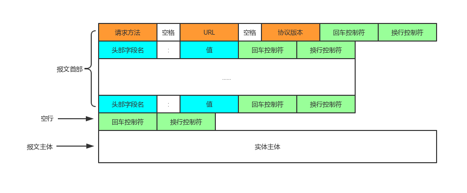
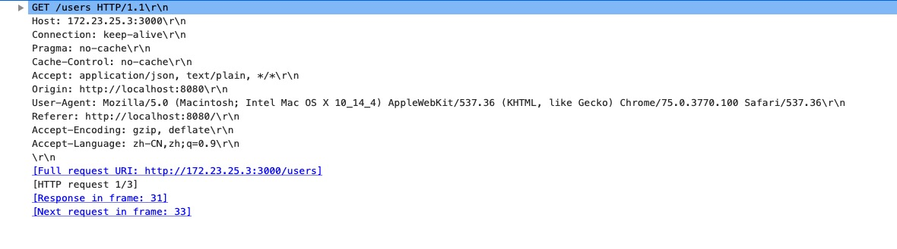
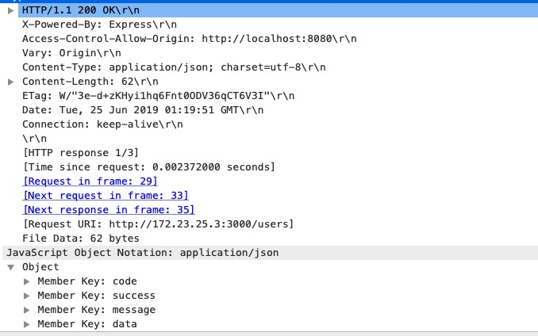
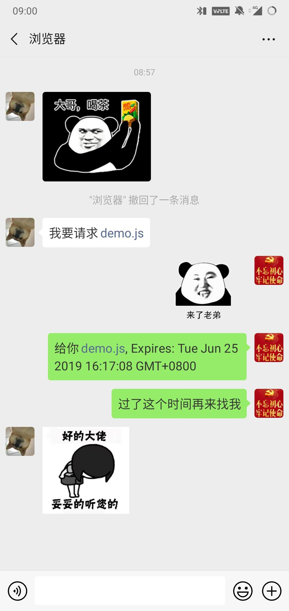
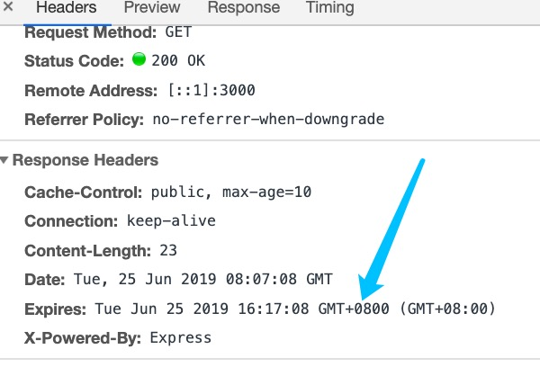
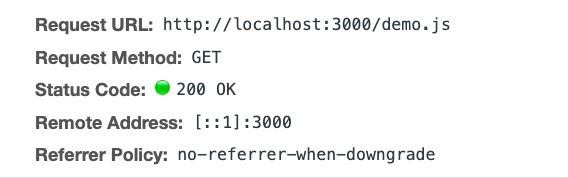
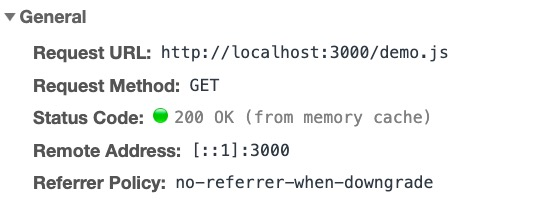
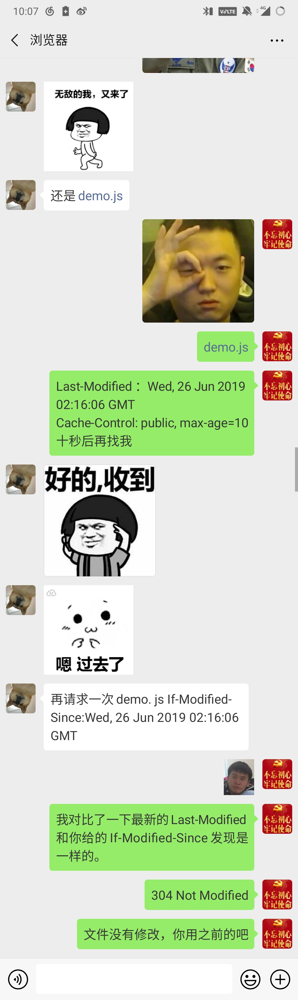
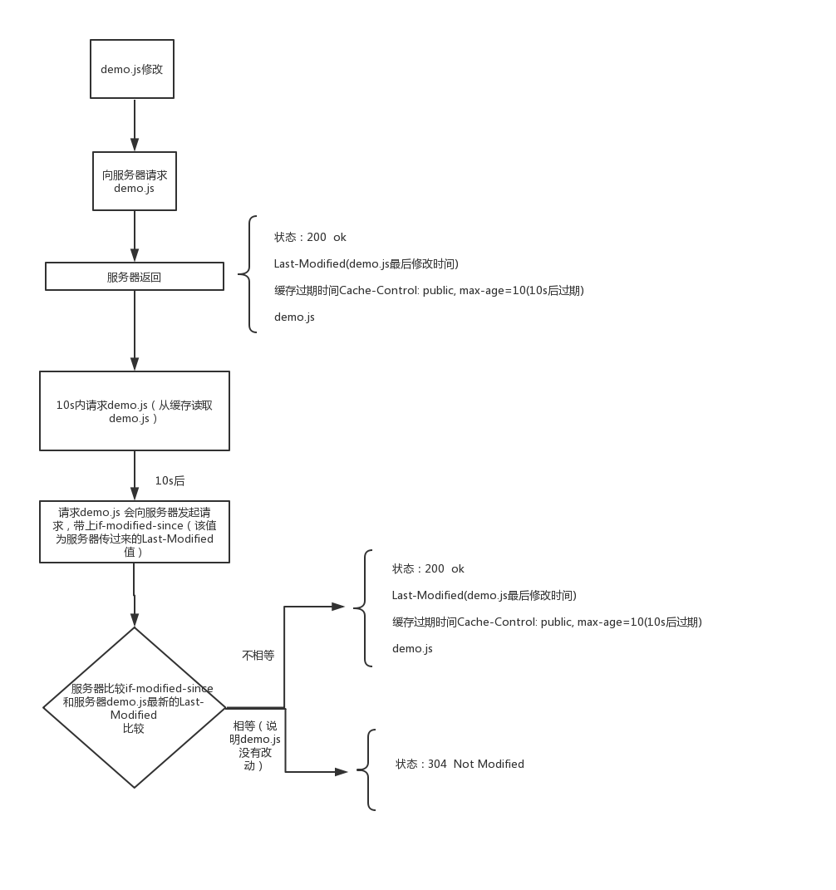
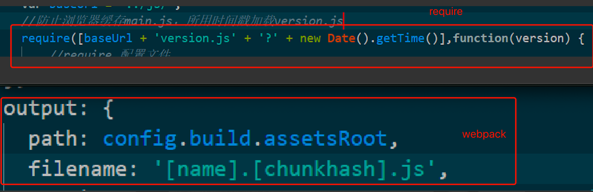

## 一、前言

可能有人会和以前的我一样，觉得缓存不是后台设置的吗，感觉和前端人员没有太大联系，平时关于缓存最常做的就是在浏览器`Ctrl+Shit+Delete`清空缓存。

web缓存可以大致分为三类：

	1. 浏览器缓存
	2. 代理缓存
	3. 网关缓存

我们这篇文章主要讲的是浏览器缓存，浏览器主要是通过http/https和服务器进行通信，所以浏览器缓存我们也可以说是HTTP缓存。
<!--more-->


## 二、什么是浏览器缓存

> 浏览器缓存（Browser Caching）是为了节约网络的资源加速浏览，浏览器在用户磁盘上对最近请求过的文档进行存储，当访问者再次请求这个页面时，浏览器就可以从本地磁盘显示文档，这样就可以加速页面的阅览。-百度百科

缓存了的文档应该怎么命中，应该什么时候删除，应该什么时候更新，所以有一套缓存机制去进行处理这些问题，下面会详细说明。

## 三、为什么用浏览器缓存

我们判断一个网站的用户体验的好坏的一个标准就是这个网站加载的速度，而影响速度的因素有很多，比如浏览器和服务器通信的时间，服务器处理时间等等，而缓存如果命中的话是从客户端取数据，所以不需要请求服务器，所以提高了加载速度。缓存存在以下优点：

1. 减少了等待时间
2. 减少了网络通信量

## 四、怎么设置浏览器缓存


### HTTP响应头
 
#### a. HTTP报文

客户端和服务端通过HTTP报文进行通信，请求端（客户端）的HTTP报文叫做请求报文，响应端（服务器端）的叫做响应报文。

HTTP报文大致可以分为报文首部和报文主体。

如图：

#####  HTTP请求报文



这个是我本地的一个ajax请求的报文。



代码如下

```　javaScript
oneClick () {
  this.$axioss.get('/users').then((response) => {
    console.log(response);
  }).catch((error) =>{
    console.log(error);
    })
}
```

可以看到请求方法为GET，请求url为‘/users’，请求协议HTTP1.1，下面是一串头部字段名和值。

下面列出了常用的几种请求方法

```
1. GET: 主要用于获取数据.
2. HEAD: 请求一个与GET请求的响应相同的响应，但没有响应体.
3. POST: 向指定资源提交数据进行处理请求（例如提交表单或者上传文件）。数据被包含在请求体中。
4. PUT: 从客户端向服务器传送的数据取代指定的文档的内容。
5. DELETE: 删除指定的资源。
```


##### HTTP响应报文


响应代码如下

```
router.get('/', function(req, res, next) {
  res.json({
    code: 200,
    success: true,
    message: '请求成功',
    data: []
  })
});
```

我们看真实的请求报文：



一开始是http协议，然后是状态码，现在是200，然后是原因短语‘OK’，下面是一串响应头部字段。

状态码描述了饭回的结果状态，用户可以根据状态码知道服务器是正常处理了请求，还是出现问题。
状态码主要类别有‘1xx’，‘2xx’，‘3xx’，‘4xx’，‘5xx’。

```
1. 1xx：信息性状态码
2. 2xx： 成功状态码
	* 200 Ok 表示请求在服务端被正常的处理了
	* 204 no content 服务器接受的请求已成功处理，但响应报文不包含实体的主体部分
	* 206 partial content 表示客户端进行了范围请求，而服务器成功执行了这部分的GET请求
3. 3xx： 重定向状态码
	* 301 moveed permanently 永久性重定向
	* 302 found 临时性重定向
	* 303 see other
	* 304 not modified
	* 307 temporary redirect 临时重定向
4. 4xx：客户端错误状态码
	* 400 bad request 请求报文存在语法错误
	* 401 unauthorized 发送的请求需要有通过http认证的认证信息
	* 403 forbidden 请求资源的访问被服务器拒绝
	* 404 not found 服务器上无法找到请求的资源
5. 5xx：服务器错误状态码
	* 500 internal server error 服务器在执行请求时发生了错误
	* 503 service unavailable 服务器暂时处于超负载或正在进行停机维护
```

##### 报文首部字段

HTTP首部字段可以分为4种类型

1. 通用首部字段
2. 请求首部字段
3. 响应首部字段
4. 实体首部字段


<table>
	<caption>通用首部字段</caption>
	<tr>
		<th>首部字段名</th>
		<th>说明</th>
	</tr>
	<tr>
		<td>Cache-Control</td>
		<td>控制缓存的行为</td>
	</tr>
	<tr>
		<td>Connection</td>
		<td>逐跳首部、连接的管理</td>
	</tr>
	<tr>
		<td>Date</td>
		<td>创建报文的日期时间</td>
	</tr>
	<tr>
		<td>Pragma</td>
		<td>报文指令</td>
	</tr>
	<tr>
		<td>Trailer</td>
		<td>报文末端的首部一览</td>
	</tr>
	<tr>
		<td>Transfer-Encoding</td>
		<td>指定报文主体的传输编码方式</td>
	</tr>
	<tr>
		<td>Upgrade</td>
		<td>升级为其他协议</td>
	</tr>
	<tr>
		<td>Via</td>
		<td>代理服务器的相关信息</td>
	</tr>
	<tr>
		<td>Warning</td>
		<td>错误通知</td>
	</tr>
</table>

<table>
	<caption>请求首部字段</caption>
	<tr>
		<th>首部字段名</th>
		<th>说明</th>
	</tr>
	<tr>
		<td>Accept</td>
		<td>用户代理可以处理的媒体类型</td>
	</tr>
	<tr>
		<td>Accept-Charset</td>
		<td>优先的字符集</td>
	</tr>
	<tr>
		<td>Accept-Encoding</td>
		<td>优先的内容编码</td>
	</tr>
	<tr>
		<td>Accept-Language</td>
		<td>优优先的语言（自然语言）</td>
	</tr>
	<tr>
		<td>Authorization</td>
		<td>web认证信息</td>
	</tr>
	<tr>
		<td>Expect</td>
		<td>期待服务器的特定行为</td>
	</tr>
	<tr>
		<td>From</td>
		<td>用户的电子邮箱</td>
	</tr>
	<tr>
		<td>Host</td>
		<td>请求资源所在服务器</td>
	</tr>
	<tr>
		<td>if-Match</td>
		<td>比较实体标记（ETag）</td>
	</tr>
	<tr>
		<td>if-modified-Since</td>
		<td>比较资源的更新时间</td>
	</tr>
	<tr>
		<td>if-none-Match</td>
		<td>比较实体标记（ETag）</td>
	</tr>
	<tr>
		<td>if-Range</td>
		<td>资源未更新时发生实体Byte的范围请求</td>
	</tr>
	<tr>
		<td>if-Unmodified-Since</td>
		<td>比较资源的更新时间（与if-Modified-Since）</td>
	</tr>

	<tr>
		<td>Max-Forwards</td>
		<td>最大传输逐跳数</td>
	</tr>
	<tr>
		<td>Proxy-Authorization</td>
		<td>代理服务器邀请客户端的认证信息</td>
	</tr>

	<tr>
		<td>Range</td>
		<td>实体的字节范围请求</td>
	</tr>
	<tr>
		<td>Referer</td>
		<td>对请求中URI的原始获取方</td>
	</tr>

	<tr>
		<td>TE</td>
		<td>传输编码的优先级</td>
	</tr>

	<tr>
		<td>User-Agent</td>
		<td>HTTP客户端程序的信息</td>
	</tr>
</table>


<table>
	<caption>响应首部字段</caption>
	<tr>
		<th>首部字段名</th>
		<th>说明</th>
	</tr>
	<tr>
		<td>Accept-Ranges</td>
		<td>是否接受字节范围请求</td>
	</tr>
	<tr>
		<td>ETag</td>
		<td>资源的匹配信息</td>
	</tr>
	<tr>
		<td>Location</td>
		<td>令客户端重定向至指定URI</td>
	</tr>
	<tr>
		<td>Proxy-Authenticate</td>
		<td>代理服务器对客户端的认证信息</td>
	</tr>
	<tr>
		<td>Retry-After</td>
		<td>对再次发起请求的时机要求</td>
	</tr>
	<tr>
		<td>Server</td>
		<td>HTTP服务器的安装信息</td>
	</tr>
	<tr>
		<td>Vary</td>
		<td>代理服务器的缓存管理信息</td>
	</tr>
	<tr>
		<td>WWW-Authenticate</td>
		<td>服务器对客户端的认证信息</td>
	</tr>
</table>
<table>
	<caption>实体首部字段</caption>
	<tr>
		<th>首部字段名</th>
		<th>说明</th>
	</tr>
	<tr>
		<td>Allow</td>
		<td>资源可支持的HTTP方法</td>
	</tr>
	<tr>
		<td>Content-Encoding</td>
		<td>实体主体适用的编码方法</td>
	</tr>
	<tr>
		<td>Content-Language</td>
		<td>实体主体的自然语言</td>
	</tr>
	<tr>
		<td>Content-Length</td>
		<td>实体主体的大小（单位：字节）</td>
	</tr>
	<tr>
		<td>Content-Location</td>
		<td>代替对应资源的URI</td>
	</tr>
	<tr>
		<td>Content-MD5</td>
		<td>实体主体的报文摘要</td>
	</tr>
	<tr>
		<td>Content-Range</td>
		<td>实体主体的位置范围</td>
	</tr>
	<tr>
		<td>Content-Type</td>
		<td>实体主体的媒体类型</td>
	</tr>
	<tr>
		<td>Expires</td>
		<td>实体主体过期的日期时间</td>
	</tr>
	<tr>
		<td>Last-Modified</td>
		<td>资源最后修改日期时间</td>
	</tr>

</table>

#### b. 强缓存(Expires vs Cache-Control)
##### Expires http1.0



Expires 设置缓存过期时间

``` javaScript
res.setHeader('Expires', new Date(Date.now() + 600000));// 当前时间过十分钟后过期
```



图中表示该文件在Tue Jun 25 2019 16:17:08 GMT+0800 日期过期，所以第一次请求的时候我们可以看到状态是200，然后下次请求时从缓存中获取的资源而没有请求服务器

第一次请求



第二次请求



但是如果服务器时间和客户端时间不同步，如果服务器时间快于客户端时间的话，我们设置的缓存时间小于服务器大于客户端时间的话，那么我们设置的缓存时间就不起作用了；如果服务器时落后于客户端时间，有可能导致缓存时间已经过了，但是还是用的缓存。

为了避免这个问题，http1.1推出了Cache-Control

##### Cache-Control http1.1

Cache-Control的常见属性

1. private: 客户端可以缓存
2. public: 客户端和代理服务器都可缓存
3. max-age=xxx: 缓存的内容将在 xxx 秒后失效
4. no-cache: 需要使用对比缓存来验证缓存数据
5. no-store: 所有内容都不会缓存，强制缓存，对比缓存都不会触发


Cache-Control设置的是相对时间

	res.setHeader('Cache-Control', 'public, max-age=10');
	
这个代码设置的是缓存相对于当前时间10s后过期，这样就算服务器和客户端时间不同步也不会影响。

如果同时存在Expires和Cache-Control，Cache-Control的优先级更高。

但是不管是Expires还是Cache-Control，都是设置缓存过期时间，但是缓存时间过期后其实资源并没有改变，但是还是去请求资源了，为了解决这样的问题，所以有了协商缓存。

#### c. 协商缓存

强缓存都是浏览器通过响应报文的某个字段去设置缓存，协商缓存是通过一组字段结合起来进行缓存。

#### Last-Modified和If-Modified-Since



Last-Modified 顾名思义是最后一次修改时间，这个是服务端获取到的，在响应报文里会返回，If-Modified-Since（等于上一次请求的Last-Modified）是浏览器根据服务端返回的Last—Modified设置的，可以理解成浏览器端存储的资源的最后修改时间。

协商，也就是浏览器和服务器之间进行协商，如果资源有改动，那么服务器每次返回时会带上一个字段Last-Modified，该资源的最后修改时间，还有一个资源过期时间，可以是Cache-Control或者Expires，然后浏览器获取到这两个字段，并且保存下来，在缓存时间没有过期时，浏览器会从缓存中获取资源，不会请求服务器，等到缓存过期时，浏览器请求服务器，请求报文会带上一个字段If-Modified-Since，这个字段是上一次的Last-Modified，然后服务器会判断最新的Last-Modified和If-Modified-Since是否相等，如果相等，意味着该资源在这段时间并没有改动，那么浏览器会返回304，如果不想等的话，服务器会将最新的Last-Modified返回，并且返回改动后的资源，并且状态码为200

下面的图是一个我们修改demo.js后浏览器和服务器的通信。



这个缓存方法有两个问题：

```
1. 因为Last-Modified的时间是GMT时间，只能精确到秒，如果文件在1秒内有多次改动，服务器并不知道文件有改动，那么浏览器获取不到最新的文件。
2. 如果服务器上某资源被多次改动，但是内容并没有变化，服务器会更新改动时间，所以每次都会返回给客户端
```

为了解决这些问题，我们引入了ETag和If-None—Match
 
#### ETag和If-None-Match

上面的Last-Modified是通过资源改动时间去判断是否该给客户端返回新的资源，现在是通过ETag：资源的唯一标识来判断，只有资源的内容改变时，ETag才会改变。

If-None-Match是上一次的ETag。


#### 总结

那么到这关于http缓存的几个首部字段且含义已经介绍完了，那么问题来了，浏览器无法主动得知资源的变化，只有没有Expires或者是Cache-Control设置的缓存时间过期后，浏览器主动请求服务端以此得知资源的变化。

那么我们应该怎么解决这个问题？


<style>
.fd-img {
	display: none;
}
</style>


在公司呆的时间比较长的话看到第一段代码可能比较熟悉，以前用require.js的时候我们会在文件名后面加上版本号和时间戳，最近的项目用webpack的话，打包文件的时候也会在文件名后加上哈希数。

这样做的思路就是因为每次文件有改动后，比如js，那么会导致html页面也会跟着改动，因为html里引用了该js文件，所以浏览器去访问html页面时发现页面已经改动了，就会去请求服务器。这样我们就能做到浏览器主动得知资源的变动。


## 五、浏览器本地缓存

### (一) manifest（H5的应用缓存）
浏览器缓存中划分出了一块缓存区，如果想要在这个缓存中保存数据，可以用一个描述文件，列出要下载和缓存的资源，然后将该描述文件于页面关联起来，可以在<html>中的manifest属性中指定这个文件的路径，比如：

```
<html manifest='/offline.manifest'>
```

### （二）storage(Web 存储机制)

Web Storage 包含如下两种机制：

```
1. sessionStorage 为每一个给定的源（given origin）维持一个独立的存储区域，该存储区域在页面会话期间可用（即只要浏览器处于打开状态，包括页面重新加载和恢复）。
2. localStorage 同样的功能，但是在浏览器关闭，然后重新打开后数据仍然存在。
```

### （三）indexDB
>ndexedDB是一种低级API，用于客户端存储大量结构化数据(包括, 文件/ blobs)。该API使用索引来实现对该数据的高性能搜索。虽然 Web Storage 对于存储较少量的数据很有用，但对于存储更大量的结构化数据来说，这种方法不太有用。IndexedDB提供了一个解决方案。

### （四）cookie

>HTTP Cookie（也叫Web Cookie或浏览器Cookie）是服务器发送到用户浏览器并保存在本地的一小块数据，它会在浏览器下次向同一服务器再发起请求时被携带并发送到服务器上。通常，它用于告知服务端两个请求是否来自同一浏览器，如保持用户的登录状态。Cookie使基于无状态的HTTP协议记录稳定的状态信息成为了可能。

## 六、后记

### 参考文档

1. [前端也要懂Http缓存机制](https://juejin.im/post/5b70edd4f265da27df0938bc)

2. [面试精选之http缓存](https://juejin.im/post/5b3c87386fb9a04f9a5cb037)

3. 《图解HTTP》
4. 《JavaScript高级程序设计》